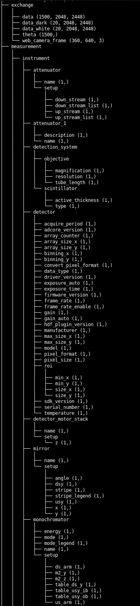
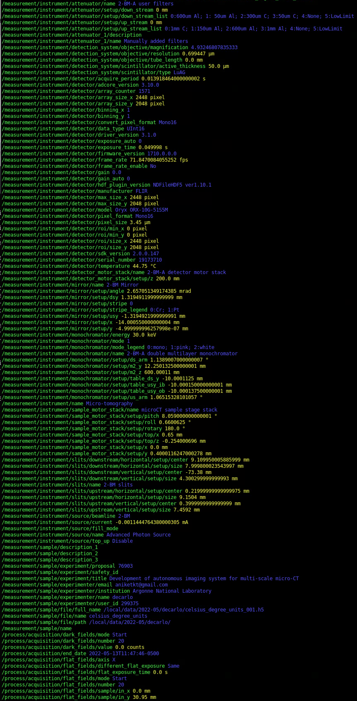

========
meta-cli
========

**meta-cli** is commad-line-interface for extracting meta data from `data exchange <https://dxfile.readthedocs.io/en/latest/source/xraytomo.html/>`_ tomographic data used at the `Advanced Photon Source <https://www.aps.anl.gov/>`_  `beamlines <https://dxfile.readthedocs.io/en/latest/source/demo/doc.areadetector.html>`_.

Installation
============

::

    $ git clone https://github.com/xray-imaging/meta-cli.git
    $ cd meta-cli
    $ python setup.py install

in a prepared virtualenv or as root for system-wide installation.

.. warning:: 
	If your python installation is in a location different from #!/usr/bin/env python please edit the first line of the bin/meta file to match yours.

Dependencies
============

- `meta <https://github.com/xray-imaging/meta.git>`_
- pandas => ``conda install pandas``
- tabulate => ``conda install tabulate``

Usage
=====

View the hdf tree
-----------------

To view the data tree contained in a generic hdf file:

::

    $ meta tree --file-name data/base_file_name_001.h5 

View the meta data
------------------

To view the meta data contained in a in a generic hdf file:

::

    $ meta show --file-name data/base_file_name_001.h5 

Meta data rst table
-------------------

To generate a meta data rst table compatible with sphinx/readthedocs::

    $ meta docs --file-name data/base_file_name_001.h5 

    2022-02-09 12:30:15,421 - General
    2022-02-09 12:30:15,422 -   config           /Users/decarlo/meta.conf
    2022-02-09 12:30:15,422 -   tree             False
    2022-02-09 12:30:15,422 -   verbose          True
    2022-02-09 12:30:16,983 - Please copy/paste the content of ./log_2020-03.rst in your rst docs file

**2022-05**

**decarlo**

+--------------------------------------------------------+--------------------+--------+
|                                                        | value              | unit   |
+========================================================+====================+========+
| 000_/measurement/instrument/monochromator/energy       | 30.0               | keV    |
+--------------------------------------------------------+--------------------+--------+
| 000_/measurement/instrument/sample_motor_stack/setup/x | 0.0                | mm     |
+--------------------------------------------------------+--------------------+--------+
| 000_/measurement/instrument/sample_motor_stack/setup/y | 0.4000116247000278 | mm     |
+--------------------------------------------------------+--------------------+--------+
| 000_/measurement/sample/experimenter/email             | decarlof@gmail.com |        |
+--------------------------------------------------------+--------------------+--------+

.. note:: 
	when using the **docs** option --h5-name can be also a folder, e.g. --h5-name data/ in this case all hdf files in the folder will be processed.

to list of all available options::

    $ meta  -h

Configuration File
------------------

meta parameters are stored in **meta.conf**. You can create a template with::

    $ meta init

**meta.conf** is constantly updated to keep track of the last stored parameters, as initalized by **init** or modified by setting a new option value. For example to re-run the last meta with identical --h5-name parameters used before just use::

    $ meta docs

