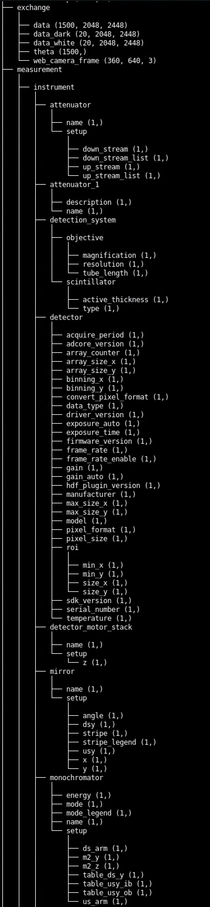
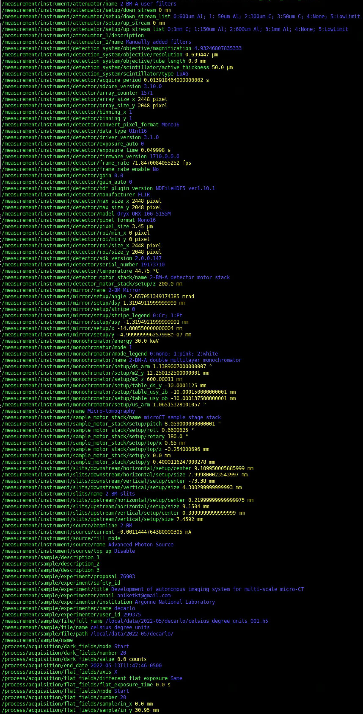

========
meta-cli
========

**meta-cli** is commad-line-interface for extracting meta data from a generic HDF file including  `data exchange <https://dxfile.readthedocs.io/en/latest/source/xraytomo.html/>`_, the tomographic data format used at the `Advanced Photon Source <https://www.aps.anl.gov/>`_  `beamlines <https://dxfile.readthedocs.io/en/latest/source/demo/doc.areadetector.html>`_.

Installation
============

::

    $ git clone https://github.com/xray-imaging/meta-cli.git
    $ cd meta-cli
    $ python setup.py install

in a prepared virtualenv or as root for system-wide installation.

.. warning:: 
	If your python installation is in a location different from #!/usr/bin/env python please edit the first line of the bin/meta file to match yours.

Dependencies
============

- `meta <https://github.com/xray-imaging/meta.git>`_
- scikit-build
- click
- h5py
- numpy
- pandas

Usage
=====

View the hdf tree
-----------------

To view the data tree contained in a generic hdf file:

::

    $ meta tree --file-name data/base_file_name_001.h5 

View the meta data
------------------

To view the meta data contained in a generic hdf file:

::

    $ meta show --file-name data/base_file_name_001.h5

``--path`` is an alias for ``--file-name`` and reads more naturally when the argument is a directory. Both accept either a single file or a directory of hdf files; when a directory is given, ``meta show`` iterates over every ``.h5`` / ``.hdf`` / ``.hdf5`` file it contains::

    $ meta show --path data/

View a subset meta data
-----------------------

To view a subset of the meta data contained in a generic hdf file:

::

    $ meta show --file-name data/base_file_name_001.h5 --key energy

Replace an hdf entry value
--------------------------

To replace the value of an entry:

 ::

    $ meta set --file-name data/base_file_name_001.h5 --key /process/acquisition/rotation/rotation_start --value 10

.. note::
    ``meta tree`` and ``meta set`` operate on a single hdf file. If you pass a directory to ``--file-name`` they warn and exit; use ``meta show`` (or ``meta rec``) for folder input.

Show the tomocupy reconstruction command
----------------------------------------

`tomocupy <https://github.com/tomography/tomocupy>`_ stores the reconstruction command line as a ``command`` string attribute on ``/exchange/data`` of every ``_rec.h5`` file. To print it back out::

    $ meta rec --file-name data/base_file_name_001_rec.h5

Add ``--save`` to also write a sibling ``base_file_name_001_rec_line.txt`` sidecar next to the input, matching what the ``tiff`` and ``h5sino`` tomocupy formats already produce::

    $ meta rec --file-name data/base_file_name_001_rec.h5 --save

Like ``meta show``, ``meta rec`` accepts a directory (via ``--file-name`` or the ``--path`` alias). It iterates over every hdf file in the folder; files that are not tomocupy rec files (raw scans, or older rec files that pre-date the ``command`` attribute) surface a clear warning and get no sidecar::

    $ meta rec --path data/reconstructed/ --save

Help
----

Both ``-h`` and ``--help`` work on the top-level command and on every subcommand::

    $ meta -h
    $ meta show -h
    $ meta rec -h
