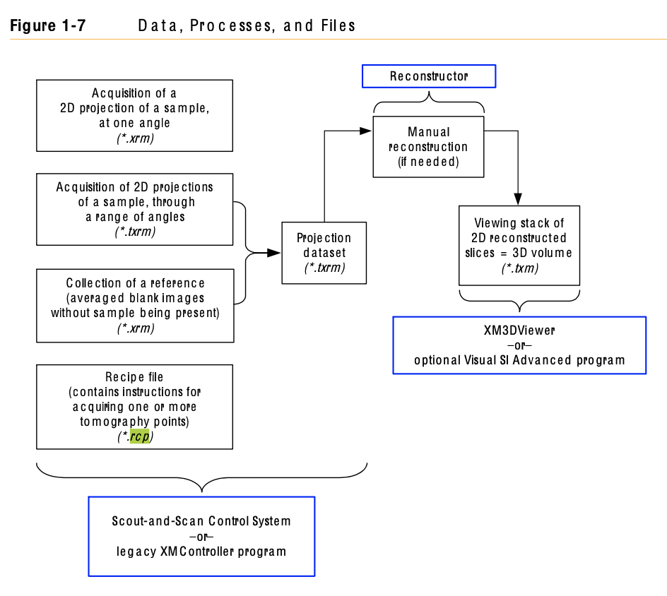

Laboratory Instruments
======================

Here we report the meta data files generated by different laboratory microCT instruments.

.. _UCL files:

UCL File
--------

Univesity College London Edge Illumination instruments generates the following meta-data files:

    #. :download:`sample_name.dtxml <../demo/ucl/scan_parameters.txt>` 

[System]

+-------------------------------------------+---------------------------+
| Owner                                     | UCL Maximum               |
+-------------------------------------------+---------------------------+
| Scanner                                   | Edge Illumination 007Mo   |
+-------------------------------------------+---------------------------+
| Location                                  | 2.09a                     |
+-------------------------------------------+---------------------------+
| Source                                    | Rigaku 007                |
+-------------------------------------------+---------------------------+
| Target                                    | Molybdenum                |
+-------------------------------------------+---------------------------+
| Detector                                  | Hamamatsu C9732DK         |
+-------------------------------------------+---------------------------+
| Camera Pixel Size [um]                    | 50                        |
+-------------------------------------------+---------------------------+
| Source to detector distance [m]           | 0.86                      |
+-------------------------------------------+---------------------------+
| Source to sample mask distance [m]        | 0.68                      |
+-------------------------------------------+---------------------------+
| Source to sample [m]                      | 0.70                      |
+-------------------------------------------+---------------------------+
| Detector to detector mask distance [m]    | 0.01                      |
+-------------------------------------------+---------------------------+
| Sample mask pitch [um]                    | 79                        |
+-------------------------------------------+---------------------------+
| Sample mask aperture [um]                 | 10                        |
+-------------------------------------------+---------------------------+
| Detector mask pitch [um]                  | 98                        |
+-------------------------------------------+---------------------------+
| Detector mask aperture [um]               | 17                        |
+-------------------------------------------+---------------------------+
| Masks type                                | Skipped                   |
+-------------------------------------------+---------------------------+

[Parameters of the CT SCAN]

+-------------------------------------------+-----------------------+
| Saving_path                               | C:/Users/test         |
+-------------------------------------------+-----------------------+
| IC_centre                                 | -28.000               |
+-------------------------------------------+-----------------------+
| IC_span                                   | 0.077                 |
+-------------------------------------------+-----------------------+
| IC_No_points                              | 11                    |
+-------------------------------------------+-----------------------+
| IC_positions_scan                         | -0.001,0,0.001,0.2    |
+-------------------------------------------+-----------------------+
| Exposure_time                             | 1.2                   |
+-------------------------------------------+-----------------------+
| Motor_No_Sample_Mask                      | 1                     |
+-------------------------------------------+-----------------------+
| G                                         | 1.0204                |
+-------------------------------------------+-----------------------+
| No_dithering                              | 1                     |
+-------------------------------------------+-----------------------+
| sample_IN_position                        | 25.0                  |
+-------------------------------------------+-----------------------+
| sample_OUT_position                       | -50.0                 |
+-------------------------------------------+-----------------------+
| Motor_No_Sample_X                         | 6                     |
+-------------------------------------------+-----------------------+
| Motor_No_Sample_ROTY                      | 7                     |
+-------------------------------------------+-----------------------+
| No_projections                            | 1000                  |
+-------------------------------------------+-----------------------+
| angular_range                             | 360                   |
+-------------------------------------------+-----------------------+
| how_many_projection_before_flat           | 200                   |
+-------------------------------------------+-----------------------+
| how_many_images_per_flat_step             | 5                     |
+-------------------------------------------+-----------------------+
| how_many_images_per_scan_step             | 1                     |
+-------------------------------------------+-----------------------+
| start_from_projection                     | 0                     |
+-------------------------------------------+-----------------------+
| sub_acquisition_start                     | 0                     |
+-------------------------------------------+-----------------------+
| jitter_flag                               | 1                     |
+-------------------------------------------+-----------------------+
| extra_projection_flag                     | 1                     |
+-------------------------------------------+-----------------------+

.. _Ge files:

GE Files
--------

GE Phoenix instruments generates the following meta-data files:

    #. :download:`sample_name.dtxml <../demo/ge/FEG230530_409-run-files/FEG230530_409.dtxml>` 

+-----------------------+-----------------------+
| Operator              |  Goetz, Freya         |
+-----------------------+-----------------------+
| Researcher            |                       |
+-----------------------+-----------------------+
| NMNH PI               |  Osborn, KaREn        |
+-----------------------+-----------------------+
| Department            |  Invertebrate Zoology |
+-----------------------+-----------------------+
| Project Name          |                       |
+-----------------------+-----------------------+
| Project Number        |                       |
+-----------------------+-----------------------+
| Sample ID             |  usnm1615674          |
+-----------------------+-----------------------+
| Sample Description.   |  PTA+EtOH             |
+-----------------------+-----------------------+
| Sample Name           |  Euphausia hemigibba  |
+-----------------------+-----------------------+
| Sample Type           |                       |
+-----------------------+-----------------------+

    #. :download:`sample_name.pca <../demo/ge/FEG230530_409-run-files/FEG230530_409.pca>` 

[General]

+-----------------------+------------------------------------------------------------------+
| Version               |   2.4.0.1843                                                     |
+-----------------------+------------------------------------------------------------------+
| Version-pca           |   2                                                              |
+-----------------------+------------------------------------------------------------------+
| Comment               |                                                                  |
+-----------------------+------------------------------------------------------------------+
| LoadDefault           |   1                                                              | 
+-----------------------+------------------------------------------------------------------+
| SystemName            |   National Museum of Natural History GE Phoenix v tome x m µCT   |
+-----------------------+------------------------------------------------------------------+

[AutoScO]

+-----------------------+------------------------------------------------------------------+
| Active                |   1                                                              |
+-----------------------+------------------------------------------------------------------+
| ImgNr                 |   8                                                              |
+-----------------------+------------------------------------------------------------------+
| ImageString           |   162:324:486:648:810:972:1134:1300                              |
+-----------------------+------------------------------------------------------------------+
| Skip                  |   10                                                             |
+-----------------------+------------------------------------------------------------------+

[Geometry]

+-----------------------+------------------+
| FDD                   |   807.13534640   |
+-----------------------+------------------+
| FOD                   |   41.52975000    |
+-----------------------+------------------+
| Magnification         |   19.43511209    |
+-----------------------+------------------+
| VoxelSizeX            |   0.01029065     |
+-----------------------+------------------+
| VoxelSizeY            |   0.01029065     |
+-----------------------+------------------+
| CalibValue            |   28.524         |
+-----------------------+------------------+
| cx                    |   1006.50000000  |
+-----------------------+------------------+
| cy                    |   1011.50000000  |
+-----------------------+------------------+
| DetectorRot           |   0.00000000     |
+-----------------------+------------------+
| Tilt                  |   0.00000000     |
+-----------------------+------------------+
| Old_CalibValue        |   0.00000000     |
+-----------------------+------------------+

[CT]

+-----------------------+-------------------+
| Type                  |   0               |
+-----------------------+-------------------+
| NumberImages          |   1300            |
+-----------------------+-------------------+
| StartImg              |   1301            |
+-----------------------+-------------------+
| RotationSector        |   360.00000000    |
+-----------------------+-------------------+
| NoRotation            |   0               |
+-----------------------+-------------------+
| EstimatedTime         |   0               |
+-----------------------+-------------------+
| RemainingTime         |   1300            |
+-----------------------+-------------------+
| ScanTimeCmpl          |   1300            |
+-----------------------+-------------------+
| NrImgDone             |   1301            |
+-----------------------+-------------------+
| NrImgCmplScan         |   1301            |
+-----------------------+-------------------+
| RefDriveEnabled       |   0               |
+-----------------------+-------------------+
| SkipForNewInterval    |   25              |
+-----------------------+-------------------+
| SkipAcc               |   1               |
+-----------------------+-------------------+
| FreeRayFactor         |   1.00010000      |
+-----------------------+-------------------+
| Wnd_L                 |   0               |
+-----------------------+-------------------+
| Wnd_T                 |   0               |
+-----------------------+-------------------+
| Wnd_R                 |   10              |
+-----------------------+-------------------+
| Wnd_B                 |   10              |
+-----------------------+-------------------+
| Level                 |   3123.00000000   |
+-----------------------+-------------------+

[VSensor]

+-----------------------+--------+
| EnableTiles           |   1    |
+-----------------------+--------+
| Start                 |   0    |
+-----------------------+--------+
| NumTiles              |   1    |
+-----------------------+--------+
| Interval              |   60   |
+-----------------------+--------+
| Overlap               |   9    |
+-----------------------+--------+
| AdjustImg             |   1    |
+-----------------------+--------+
| SingleImgX            |   2024 |
+-----------------------+--------+

[Trajectory]

+-----------------------+-------+
| Active                |   0   |
+-----------------------+-------+

[CalibValue]

+-----------------------+-------+
| NumberImages          |   18  |
+-----------------------+-------+
| Averaging             |   2   |
+-----------------------+-------+
| Skip                  |   3   |
+-----------------------+-------+

[FastCT]

+-----------------------+-------+
| Active                |   0   |
+-----------------------+-------+

[Image]

+-----------------------+--------+
| Top                   |   0    |
+-----------------------+--------+
| Left                  |   0    |
+-----------------------+--------+
| Bottom                |   2023 |
+-----------------------+--------+
| Right                 |   2023 |
+-----------------------+--------+
| DimX                  |   2014 |
+-----------------------+--------+
| DimY                  |   2024 |
+-----------------------+--------+
| Rotation              |   0    |
+-----------------------+--------+
| FreeRay               |   3250 |
+-----------------------+--------+

[ImgProc]

+-----------------------+-------+
| SwBin                 |   1   |
+-----------------------+-------+
| AddSwBin              |   0   |
+-----------------------+-------+

[Warmup]

+-----------------------+-------+
| Enable                |   1   |
+-----------------------+-------+
| Counter               |   0   |
+-----------------------+-------+
| MaxTimes              |   10  |
+-----------------------+-------+
| TimeTrigOn            |   0   |
+-----------------------+-------+
| kV                    |   95  |
+-----------------------+-------+
| Time                  |   60  |
+-----------------------+-------+

[Multiscan]

+-----------------------+-------+
| Active                |   0   |
+-----------------------+-------+

[Multiline]

+-----------------------+-------+
| Installed             |   0   |
+-----------------------+-------+

[CalibImages]

+-----------------------+-------------------------------------------------------------------------------------------------------------------+
| MGainPoints           |   2                                                                                                               |
+-----------------------+-------------------------------------------------------------------------------------------------------------------+
| Avg                   |   100                                                                                                             |
+-----------------------+-------------------------------------------------------------------------------------------------------------------+
| Skip                  |   10                                                                                                              |
+-----------------------+-------------------------------------------------------------------------------------------------------------------+
| EnableAutoAcq         |   1                                                                                                               |
+-----------------------+-------------------------------------------------------------------------------------------------------------------+
| MGainVoltage          |   90:90:                                                                                                          |
+-----------------------+-------------------------------------------------------------------------------------------------------------------+
| MGainCurrent          |   30:110:                                                                                                         |
+-----------------------+-------------------------------------------------------------------------------------------------------------------+
| GainImg               |   S:\\CT_DATA\\Invertebrate Zoology\\Goetz, Freya\\FEG230530_409\\FEG230530_409_bright_90kV_110uA_500ms_1Det.tif  |
+-----------------------+-------------------------------------------------------------------------------------------------------------------+
| MGainImg              |   S:\\CT_DATA\\Invertebrate Zoology\\Goetz, Freya\\FEG230530_409\\FEG230530_409_bright_90kV_110uA_500ms_1Det.tif  |
+-----------------------+-------------------------------------------------------------------------------------------------------------------+
| OffsetImg             |   S:\\CT_DATA\Invertebrate Zoology\\Goetz, Freya\\FEG230530_409\\FEG230530_409_Dark_500.tif                       |
+-----------------------+-------------------------------------------------------------------------------------------------------------------+
| DefPixelImg           |   C:\\Program Files\\phoenix x-ray\\datosx 2 acq\\CalibrationImages\\pixmask_B1x1_x2024_y2024.tif                 |
+-----------------------+-------------------------------------------------------------------------------------------------------------------+

[SectorScan]

+-----------------------+--------+
| Active                |   0    |
+-----------------------+--------+

[DetectorShift]

+-----------------------+---------+
| Enable                |   1     |
+-----------------------+---------+
| Mode                  |   0     |
+-----------------------+---------+
| Amplitude             |   5     |
+-----------------------+---------+
| Interval              |   1     |
+-----------------------+---------+
| Step                  |   1     |
+-----------------------+---------+

[Detector]

+-----------------------+--------------+
| InitTimeOut           |   60000      |
+-----------------------+--------------+
| Name                  |   dxr-250    |
+-----------------------+--------------+
| PixelsizeX            |   0.20000000 |
+-----------------------+--------------+
| PixelsizeY            |   0.20000000 |
+-----------------------+--------------+
| NrPixelsX             |   2024       |
+-----------------------+--------------+
| NrPixelsY             |   2024       |
+-----------------------+--------------+
| Timing                |   4          |
+-----------------------+--------------+
| TimingVal             |   500.102    |
+-----------------------+--------------+
| Avg                   |   3          |
+-----------------------+--------------+
| Skip                  |   1          |
+-----------------------+--------------+
| Binning               |   0          |
+-----------------------+--------------+
| BitPP                 |   16         |
+-----------------------+--------------+
| CameraGain            |   2          |
+-----------------------+--------------+
| SatValue              |   15563      |
+-----------------------+--------------+
| SatPixNrLimit         |   4096       |
+-----------------------+--------------+

[Xray]

+-----------------------+-------------+
| ComPort               |   0         |
+-----------------------+-------------+
| Name                  |   xs 240 d  |
+-----------------------+-------------+
| ID                    |   2682      |
+-----------------------+-------------+
| InitTimeout           |   20000     |
+-----------------------+-------------+
| Voltage               |   90        |
+-----------------------+-------------+
| Current               |   110       |
+-----------------------+-------------+
| Mode                  |   0         |
+-----------------------+-------------+
| Filter                |   Unknown   |
+-----------------------+-------------+
| Collimation           |   -1        |
+-----------------------+-------------+
| WaitTime              |   1000      |
+-----------------------+-------------+
| WaitForStable         |   30000     |
+-----------------------+-------------+
| FocDistX              |   0.0000000 |
+-----------------------+-------------+
| FocDistY              |   0.0000000 |
+-----------------------+-------------+
| SpinStepkV            |   10        |
+-----------------------+-------------+
| SpinStepuA            |   10        |
+-----------------------+-------------+
| Macro                 |   0         |
+-----------------------+-------------+
| RestrictNumSpots      |   0         |
+-----------------------+-------------+
| PreWarning            |   0         |
+-----------------------+-------------+
| MinGainCurrent        |   10        |
+-----------------------+-------------+

[Cnc]

+-----------------------+----------------+
| InitTimeout           |   8000         |
+-----------------------+----------------+
| JoyDriveDoorOpen      |   0            |
+-----------------------+----------------+
| SecPosSample          |   250.00000000 |
+-----------------------+----------------+
| MinSampleDetPos       |   300.00000000 |
+-----------------------+----------------+
| EnableKeyboardJoy     |   0            |
+-----------------------+----------------+
| KeyJoyVelocityFactor  |   0.25000000   |
+-----------------------+----------------+

[CNC_0]

+-----------------------+----------------+
| DtxName               |   XS           |
+-----------------------+----------------+
| LoadPos               |   -149.999250  |
+-----------------------+----------------+
| AcqPos                |   0.000000     |
+-----------------------+----------------+

[CNC_1]

+-----------------------+----------------+
| DtxName               |   YS           |
+-----------------------+----------------+
| LoadPos               |   398.000000   |
+-----------------------+----------------+
| AcqPos                |   232.685562   |
+-----------------------+----------------+

[CNC_2]

+-----------------------+----------------+
| DtxName               |   ZS           |
+-----------------------+----------------+
| LoadPos               |   250.000188   |
+-----------------------+----------------+
| AcqPos                |   41.529750    |
+-----------------------+----------------+

[CNC_3]

+-----------------------+----------------+
| DtxName               |   RS           |
+-----------------------+----------------+
| LoadPos               |   1.646100     |
+-----------------------+----------------+
| AcqPos                |   0.000000     |
+-----------------------+----------------+

[CNC_4]

+-----------------------+----------------+
| DtxName               |   XD           |
+-----------------------+----------------+
| LoadPos               |   0.199750     |
+-----------------------+----------------+
| AcqPos                |   0.000000     |
+-----------------------+----------------+

[Axis]

+-----------------------+----------------+
| XSample               |   0.000000     |
+-----------------------+----------------+
| YSample               |   232.685562   |
+-----------------------+----------------+
| ZSample               |   41.529750    |
+-----------------------+----------------+
| RSample               |   0.000000     |
+-----------------------+----------------+
| XDetector             |   0.000000     |
+-----------------------+----------------+

[AcqSrvManager]

+-----------------------+---------------------------------------------------------------------+
| RecvPcIp              |                                                                     |
+-----------------------+---------------------------------------------------------------------+
| ExePath               |   c:\\Program Files\\phoenix x-ray\\datosx 2 acq\\srv\\dtxaSrv.exe  |
+-----------------------+---------------------------------------------------------------------+

[Net]

+-----------------------+---------+
| Enable                |   0     |
+-----------------------+---------+
| IP                    |         |
+-----------------------+---------+

[BHC_Values]

+-----------------------+---------+
| BHC_Param             |   2     |
+-----------------------+---------+

    #. :download:`sample_name.pcj <../demo/ge/FEG230530_409-run-files/FEG230530_409.pcj>` 

[Info]

+-------------------------+---------------------------------------------------------------------+
| TrajectoryType          |   0                                                                 |
+-------------------------+---------------------------------------------------------------------+
| SystemType              |   20768                                                             |                                             
+-------------------------+---------------------------------------------------------------------+
| SystemName              |   National Museum of Natural History GE Phoenix v|tome|x m µCT      |
+-------------------------+---------------------------------------------------------------------+
| NumImages               |   1300                                                              |
+-------------------------+---------------------------------------------------------------------+
| NumSensors              |    1                                                                |
+-------------------------+---------------------------------------------------------------------+

[Data]

+---------+-------------+-------------+--------------+-------------+-------------+----------+----------+-----------+------------+
| ImgNr   |      XS     |     YS      |       ZS     |       RS    |      XD     |   Warmup |  VSenCnt | TimeStamp |  ChangeCnt |
+---------+-------------+-------------+--------------+-------------+-------------+----------+----------+-----------+------------+
|   1     |  0.0000000  | 232.6855625 |  -41.5297500 |   0.0000000 |  -1.0000000 |      0   |      0   |    0      |     0      |
+---------+-------------+-------------+--------------+-------------+-------------+----------+----------+-----------+------------+
|   2     |  0.0000000  | 232.6855625 |  -41.5297500 |   0.2769231 |  0.2000000  |      0   |      0   |    0      |     0      |
+---------+-------------+-------------+--------------+-------------+-------------+----------+----------+-----------+------------+
|   3     |  0.0000000  | 232.6855625 |  -41.5297500 |   0.5538462 |  -0.6000000 |      0   |      0   |    0      |     0      |
+---------+-------------+-------------+--------------+-------------+-------------+----------+----------+-----------+------------+
|   4     |  0.0000000  | 232.6855625 |  -41.5297500 |   0.8307692 |  0.6000000  |      0   |      0   |    5554   |     0      |
+---------+-------------+-------------+--------------+-------------+-------------+----------+----------+-----------+------------+

    #. :download:`sample_name.pcp <../demo/ge/FEG230530_409-run-files/FEG230530_409.pcp>` 

datos|x 2 acquisition 2.4.0

+---------+-------------+------------+--------------+-------------+-------------+----------+--------------+-------------------------+
|   ImgNr |  RotPos     |     U      |       I      |     MeanGV  |     DevGV   |    Dose  |  Use CValue  |   XDShift Time          |
+---------+-------------+------------+--------------+-------------+-------------+----------+--------------+-------------------------+
|   1     | 0.000       |    90      |      109     |    3151.3   |    -0.9     |   0.0 1  | 0.000   -5   |  2023-05-30 09:58:20    |
+---------+-------------+------------+--------------+-------------+-------------+----------+--------------+-------------------------+
|   2     | 0.277       |    90      |      109     |    3153.1   |    -0.9     |   0.0 1  | 0.000   1    |  2023-05-30 09:58:22    |
+---------+-------------+------------+--------------+-------------+-------------+----------+--------------+-------------------------+
|   3     | 0.554       |    90      |      108     |    3152.6   |    -0.9     |   0.0 1  | 0.000   -3   |  2023-05-30 09:58:24    |
+---------+-------------+------------+--------------+-------------+-------------+----------+--------------+-------------------------+
|   4     | 0.831       |    90      |      109     |    3159.1   |    -1.1     |   0.0 1  | 0.000   3    |  2023-05-30 09:58:26    |
+---------+-------------+------------+--------------+-------------+-------------+----------+--------------+-------------------------+

    #. :download:`sample_name.pcr <../demo/ge/FEG230530_409-run-files/FEG230530_409.pcr>` 

[Versions]

+---------------------------+---------------------+
| Version-PCR               |   2                 |
+---------------------------+---------------------+
| Version-datos|x           |   2.4.0.1199 - RTM  |
+---------------------------+---------------------+

[General]

+-------------------------------+------+
| ParameterSetOnly              |   0  |
+-------------------------------+------+

[ImageData]

+-----------------------+-------------------------------------------------------------------------------------+
| PCA_File              |   S:\\CT_DATA\\Invertebrate Zoology\\Goetz, Freya\\FEG230530_409\\FEG230530_409.pca |
+-----------------------+-------------------------------------------------------------------------------------+

[ROI]

+-----------------------+-----------+
| ROI_SizeX             |   456     |
+-----------------------+-----------+
| ROI_SizeY             |   531     |  
+-----------------------+-----------+
| ROI_SizeZ             |   1951    |  
+-----------------------+-----------+
| ROI_OffX              |   97      |  
+-----------------------+-----------+
| ROI_OffY              |   -273.5  |
+-----------------------+-----------+
| ROI_OffZ              |   36.5    |
+-----------------------+-----------+

[Reconstruction Settings]

+-------------------------------+---------------------------+
| FreeRay                       |   3250                    |
+-------------------------------+---------------------------+
| UseFreeRayFromPCP             |   1                       |
+-------------------------------+---------------------------+
| CorrectionValue               |   28.52400016784668       |
+-------------------------------+---------------------------+
| ObjectRotation                |   111.5999984741211       |
+-------------------------------+---------------------------+
| RecFilterKernel               |   2                       |
+-------------------------------+---------------------------+
| ROI_Filter                    |   1                       |
+-------------------------------+---------------------------+
| StartImage                    |   1                       |
+-------------------------------+---------------------------+
| LastImage                     |   1300                    |
+-------------------------------+---------------------------+
| ImageFilter                   |   0                       |
+-------------------------------+---------------------------+
| VolumeFilter                  |   0                       |
+-------------------------------+---------------------------+
| VolumeGaussRadius             |   3                       |
+-------------------------------+---------------------------+
| VolumeUSMContrast             |   50                      |
+-------------------------------+---------------------------+
| VolumeUSMIterations           |   2                       |
+-------------------------------+---------------------------+
| VolumeUSMRadius               |   3                       |
+-------------------------------+---------------------------+
| VoxelOutlierPart              |   0                       |
+-------------------------------+---------------------------+

[VolumeData]

+---------------------------+--------------------------------------------------------------------------------------+
| Volume_SizeX              |   456                                                                                |
+---------------------------+--------------------------------------------------------------------------------------+
| Volume_SizeY              |   531                                                                                |
+---------------------------+--------------------------------------------------------------------------------------+
| Volume_SizeZ              |   1951                                                                               |
+---------------------------+--------------------------------------------------------------------------------------+
| VoxelSizeRec              |   0.0102906534448266                                                                 |
+---------------------------+--------------------------------------------------------------------------------------+
| Resolution                |   1                                                                                  |
+---------------------------+--------------------------------------------------------------------------------------+
| Format                    |   5                                                                                  |
+---------------------------+--------------------------------------------------------------------------------------+
| Min                       |   -0.0885586217045784                                                                |
+---------------------------+--------------------------------------------------------------------------------------+
| Max                       |   3.274684190750122                                                                  |
+---------------------------+--------------------------------------------------------------------------------------+
| VOL_File                  |   S:\\CT_DATA\\Invertebrate Zoology\\Goetz, Freya\\FEG230530_409\\FEG230530_409.vol  |
+---------------------------+--------------------------------------------------------------------------------------+

[BHC_Values]

+---------------------------+--------+
| BHC_Param                 |   2    |
+---------------------------+--------+
| ABC_Param_A               |   0    |
+---------------------------+--------+
| ABC_Param_B               |   0    |
+---------------------------+--------+
| ABC_Param_C               |   0    |
+---------------------------+--------+
| ABC_Param_D               |   0    |
+---------------------------+--------+
| ABC_Param_E               |   0    |
+---------------------------+--------+
| ABC_Param_F               |   0    |
+---------------------------+--------+
| ABC_Param_G               |   0    |
+---------------------------+--------+
| ABC_Param_H               |   0    |
+---------------------------+--------+
| ABC_Param_I               |   0    |
+---------------------------+--------+
| ABC_Param_J               |   0    |
+---------------------------+--------+
| ABC_Param_M               |   0    |
+---------------------------+--------+
| ABC_Threshold             |   0    |
+---------------------------+--------+
| ABC_RSquare               |   0    |
+---------------------------+--------+
| ABC_MaxThickness          |   100  |
+---------------------------+--------+

[SCO_Values]

+---------------------------+-------------+
| SCO_NumPoints             |   9         |
+---------------------------+-------------+
| SCO_0_Index               |   162       |
+---------------------------+-------------+
| SCO_0_Scale               |   1         |
+---------------------------+-------------+
| SCO_0_X                   |   -0.2      | 
+---------------------------+-------------+
| SCO_0_Y                   |   -0        | 
+---------------------------+-------------+
| SCO_1_Index               |   324       |   
+---------------------------+-------------+
| SCO_1_Scale               |   1.0003    |         
+---------------------------+-------------+
| SCO_1_X                   |   0.1       | 
+---------------------------+-------------+
| SCO_1_Y                   |   -0        | 
+---------------------------+-------------+
| SCO_2_Index               |   486       | 
+---------------------------+-------------+
| SCO_2_Scale               |   1.0007    | 
+---------------------------+-------------+
| SCO_2_X                   |   0.5       | 
+---------------------------+-------------+
| SCO_2_Y                   |   -0        | 
+---------------------------+-------------+
| SCO_3_Index               |   648       | 
+---------------------------+-------------+
| SCO_3_Scale               |   1.0004    |         
+---------------------------+-------------+
| SCO_3_X                   |   0.4       | 
+---------------------------+-------------+
| SCO_3_Y                   |   -0        | 
+---------------------------+-------------+
| SCO_4_Index               |   810       | 
+---------------------------+-------------+
| SCO_4_Scale               |   1.0003    |         
+---------------------------+-------------+
| SCO_4_X                   |   0         | 
+---------------------------+-------------+
| SCO_4_Y                   |   0         | 
+---------------------------+-------------+
| SCO_5_Index               |   972       | 
+---------------------------+-------------+
| SCO_5_Scale               |   1.0008    | 
+---------------------------+-------------+
| SCO_5_X                   |   -0.7      | 
+---------------------------+-------------+
| SCO_5_Y                   |   -0.2      | 
+---------------------------+-------------+
| SCO_6_Index               |   1134      | 
+---------------------------+-------------+
| SCO_6_Scale               |   1.0006    | 
+---------------------------+-------------+
| SCO_6_X                   |   -1.1      | 
+---------------------------+-------------+
| SCO_6_Y                   |   -0.1      | 
+---------------------------+-------------+
| SCO_7_Index               |   1300      | 
+---------------------------+-------------+
| SCO_7_Scale               |   1.0002    | 
+---------------------------+-------------+
| SCO_7_X                   |   -1        | 
+---------------------------+-------------+
| SCO_7_Y                   |   0         | 
+---------------------------+-------------+
| SCO_8_Index               |   1301      | 
+---------------------------+-------------+
| SCO_8_Scale               |   1.0002    | 
+---------------------------+-------------+
| SCO_8_X                   |   -0.9      | 
+---------------------------+-------------+
| SCO_8_Y                   |   0.1       | 
+---------------------------+-------------+

[Metrology]

+---------------------------+-------------+
|   DetectorMaskUsed        |   0         |
+---------------------------+-------------+

.. _Bruker files:

Bruker files
------------

Bruker SkyScan 1272 instruments generates the following meta-data files:

    #. :download:`sample_name.log <../demo/skyscan_1272/DRP_P21_3/DRP_P21_3.log>` 

[System]
~~~~~~~~

+---------------------------+-----------------------+
|**Scanner**                | **SkyScan1272**       |
+---------------------------+-----------------------+
|Instrument S/N             | 19N09230              |
+---------------------------+-----------------------+
|Software Version           | 1.4                   |
+---------------------------+-----------------------+
|Home Directory             | C:\\SkyScan1272       |
+---------------------------+-----------------------+
|Source Type                | HAMAMATSU_L10101-67   |
+---------------------------+-----------------------+
|Camera Type                | XIMEA xiRAY11         |
+---------------------------+-----------------------+
|Camera Pixel Size (um)     | 9.0                   |
+---------------------------+-----------------------+
|Camera X/Y Ratio           | 0.9851                |
+---------------------------+-----------------------+

[User]
~~~~~~

+---------------------------+-----------------------+
|  User Name                |    Skyscan            |
+---------------------------+-----------------------+
|  Computer Name            |    SCAN1272-230       |
+---------------------------+-----------------------+

[Acquisition]
~~~~~~~~~~~~~

+-----------------------------------------+-------------------------------------+
| Data Directory                          |     D:\\Results\\2023_03_14 P21_3   |
+-----------------------------------------+-------------------------------------+
| Filename Prefix                         |     DRP_P21_3~00                    |
+-----------------------------------------+-------------------------------------+
| Filename Index Length                   |     8                               |
+-----------------------------------------+-------------------------------------+
| Number Of Files                         |     471                             |
+-----------------------------------------+-------------------------------------+
| **Number Of Rows**                      |     896                             |
+-----------------------------------------+-------------------------------------+
| **Number Of Columns**                   |     1075                            |
+-----------------------------------------+-------------------------------------+
| Partial Width                           |     80%                             |
+-----------------------------------------+-------------------------------------+
| Image crop origin X                     |     134                             |
+-----------------------------------------+-------------------------------------+
| Image crop origin Y                     |     0                               |
+-----------------------------------------+-------------------------------------+
| Camera binning                          |     3x3                             |
+-----------------------------------------+-------------------------------------+
| Image Rotation                          |     0.05700                         |
+-----------------------------------------+-------------------------------------+
| Optical Axis (line)                     |     528                             |
+-----------------------------------------+-------------------------------------+
| **Camera to Source (mm)**               |     270.98833                       |
+-----------------------------------------+-------------------------------------+
| **Object to Source (mm)**               |     200.70900                       |
+-----------------------------------------+-------------------------------------+
| **Source Voltage (kV)**                 |     60                              |
+-----------------------------------------+-------------------------------------+
| Source Current (uA)                     |     166                             |
+-----------------------------------------+-------------------------------------+
| Image Pixel Size (um)                   |     19.797722                       |
+-----------------------------------------+-------------------------------------+
| **Scaled Image Pixel Size (um)**        |     19.797722                       |
+-----------------------------------------+-------------------------------------+
| **Image Format**                        |     TIFF                            |
+-----------------------------------------+-------------------------------------+
| **Depth (bits)**                        |     16                              |
+-----------------------------------------+-------------------------------------+
| Reference Intensity                     |     57000                           |
+-----------------------------------------+-------------------------------------+
| Camera position                         |     Far                             |
+-----------------------------------------+-------------------------------------+
| **Exposure (ms)**                       |     1175                            |
+-----------------------------------------+-------------------------------------+
| **Rotation Step (deg)**                 |     0.400                           |
+-----------------------------------------+-------------------------------------+
| **Use 360 Rotation**                    |     NO                              |
+-----------------------------------------+-------------------------------------+
| Scanning position                       |     28.344 mm                       |
+-----------------------------------------+-------------------------------------+
| **Frame Averaging**                     |     ON (3)                          |
+-----------------------------------------+-------------------------------------+
| **Random Movement**                     |     ON (20)                         |
+-----------------------------------------+-------------------------------------+
| **Flat Field Correction**               |     ON                              |
+-----------------------------------------+-------------------------------------+
| **FF updating interval**                |     68                              |
+-----------------------------------------+-------------------------------------+
| Geometrical Correction                  |     ON                              |
+-----------------------------------------+-------------------------------------+
| **Filter**                              |     Al 0.25mm                       |
+-----------------------------------------+-------------------------------------+
| Gantry direction                        |     CC                              |
+-----------------------------------------+-------------------------------------+
| Rotation Direction                      |     CC                              |
+-----------------------------------------+-------------------------------------+
| Type of Detector Motion                 |     STEP AND SHOOT                  |
+-----------------------------------------+-------------------------------------+
| Scanning Trajectory                     |     ROUND                           |
+-----------------------------------------+-------------------------------------+
| Beam position                           |     0                               |
+-----------------------------------------+-------------------------------------+
| Skip extra frame                        |     On                              |
+-----------------------------------------+-------------------------------------+
| Source spot size                        |     Small                           |
+-----------------------------------------+-------------------------------------+
| Number Of Horizontal Offset Positions   |     1                               |
+-----------------------------------------+-------------------------------------+
| Number of connected scans               |     2                               |
+-----------------------------------------+-------------------------------------+
| Current scan number                     |     1                               |
+-----------------------------------------+-------------------------------------+
| Number of lines to be reconstructed     |     578                             |
+-----------------------------------------+-------------------------------------+
| Study Date and Time                     |     14 Mar 2023  09h:00m:40s        |
+-----------------------------------------+-------------------------------------+
| **Scan duration**                       |     0h:54m:2s                       |
+-----------------------------------------+-------------------------------------+
| Maximum vertical TS                     |     5.0                             |
+-----------------------------------------+-------------------------------------+

[Reconstruction]
~~~~~~~~~~~~~~~~

+-----------------------------------------------------+-------------------------------------------------+
| **Reconstruction Program**                          |     NRecon                                      |
+-----------------------------------------------------+-------------------------------------------------+
| **Program Version**                                 |     Version: 2.0.0.5                            |
+-----------------------------------------------------+-------------------------------------------------+
| Program Home Directory                              |     C:\\SkyScan1272                             |
+-----------------------------------------------------+-------------------------------------------------+
| Reconstruction engine                               |     GPUReconServer                              |
+-----------------------------------------------------+-------------------------------------------------+
| Engine version                                      |     Version: 2.0.0                              |
+-----------------------------------------------------+-------------------------------------------------+
| Reconstruction from batch                           |     No                                          |
+-----------------------------------------------------+-------------------------------------------------+
| Postalignment Applied                               |     1                                           |
+-----------------------------------------------------+-------------------------------------------------+
| Reconstructed using oversize                        |     option=Yes                                  |
+-----------------------------------------------------+-------------------------------------------------+
| Connected Reconstruction (parts)                    |     2                                           |
+-----------------------------------------------------+-------------------------------------------------+
| Sub-scan post alignment [0]                         |     0.000000                                    |
+-----------------------------------------------------+-------------------------------------------------+
| Sub-scan post alignment [1]                         |     1.500000                                    |
+-----------------------------------------------------+-------------------------------------------------+
| Sub-scan scan length [0]                            |     573                                         |
+-----------------------------------------------------+-------------------------------------------------+
| Sub-scan scan length [1]                            |     578                                         |
+-----------------------------------------------------+-------------------------------------------------+
| Used extra rotation per scan(deg)                   |     0.000  0.000                                |
+-----------------------------------------------------+-------------------------------------------------+
| Used extra shift in X per scan(micron)              |     0.000  -2.152                               |
+-----------------------------------------------------+-------------------------------------------------+
| Used extra shift in Y per scan(micron)              |     0.000  4.272                                |
+-----------------------------------------------------+-------------------------------------------------+
| Reconstruction servers                              |     SCAN1272-230                                | 
+-----------------------------------------------------+-------------------------------------------------+
| Dataset Origin                                      |     SkyScan1272                                 |
+-----------------------------------------------------+-------------------------------------------------+
| Dataset Prefix                                      |     DRP_P21_3~00                                |
+-----------------------------------------------------+-------------------------------------------------+
| Dataset Directory                                   |     D:\\Results\\2023_03_14 P21_3               |
+-----------------------------------------------------+-------------------------------------------------+
| Output Directory                                    |     D:\\Results\\2023_03_14 P21_3\\DRP_P21_3_Rec|
+-----------------------------------------------------+-------------------------------------------------+
| Time and Date                                       |     14 Mar 2023  10h:02m:54s                    |
+-----------------------------------------------------+-------------------------------------------------+
| **First Section**                                   |     27                                          |
+-----------------------------------------------------+-------------------------------------------------+
| **Last Section**                                    |     1454                                        |
+-----------------------------------------------------+-------------------------------------------------+
| Reconstruction duration per slice (seconds)         |     0.016497                                    |
+-----------------------------------------------------+-------------------------------------------------+
| Total reconstruction time (788 slices) in seconds   |     13.000000                                   |
+-----------------------------------------------------+-------------------------------------------------+
| Section to Section Step                             |     1                                           |
+-----------------------------------------------------+-------------------------------------------------+
| Sections Count                                      |     1428                                        |
+-----------------------------------------------------+-------------------------------------------------+
|** Result File Type**                                |     BMP                                         |
+-----------------------------------------------------+-------------------------------------------------+
| Result File Header Length (bytes)                   |     1134                                        |
+-----------------------------------------------------+-------------------------------------------------+
| Result Image Width (pixels)                         |     944                                         |
+-----------------------------------------------------+-------------------------------------------------+
| Result Image Height (pixels)                        |     944                                         |
+-----------------------------------------------------+-------------------------------------------------+
| Pixel Size (um)                                     |     19.79772                                    |
+-----------------------------------------------------+-------------------------------------------------+
| Reconstruction Angular Range (deg)                  |     188.40                                      |
+-----------------------------------------------------+-------------------------------------------------+
| Use 180+                                            |     OFF                                         |
+-----------------------------------------------------+-------------------------------------------------+
| Angular Step (deg)                                  |     0.4000                                      |
+-----------------------------------------------------+-------------------------------------------------+
| Smoothing                                           |     1                                           |
+-----------------------------------------------------+-------------------------------------------------+
| Smoothing kernel                                    |     0 (Asymmetrical boxcar)                     |
+-----------------------------------------------------+-------------------------------------------------+
| Ring Artifact Correction                            |     5                                           |
+-----------------------------------------------------+-------------------------------------------------+
| Draw Scales                                         |     OFF                                         |
+-----------------------------------------------------+-------------------------------------------------+
| Object Bigger than FOV                              |     OFF                                         |
+-----------------------------------------------------+-------------------------------------------------+
| Reconstruction from ROI                             |     ON_ROUND                                    |
+-----------------------------------------------------+-------------------------------------------------+
| ROI Top (pixels)                                    |     1012                                        |
+-----------------------------------------------------+-------------------------------------------------+
| ROI Bottom (pixels)                                 |     65                                          |
+-----------------------------------------------------+-------------------------------------------------+
| ROI Left (pixels)                                   |     125                                         |
+-----------------------------------------------------+-------------------------------------------------+
| ROI Right (pixels)                                  |     1072                                        |
+-----------------------------------------------------+-------------------------------------------------+
| ROI reference length                                |     1075                                        |
+-----------------------------------------------------+-------------------------------------------------+
| Filter cutoff relative to Nyquist frequency         |     100                                         |
+-----------------------------------------------------+-------------------------------------------------+
| Filter type                                         |     0                                           |
+-----------------------------------------------------+-------------------------------------------------+
| Filter type description                             |     Hamming (Alpha=0.54)                        |
+-----------------------------------------------------+-------------------------------------------------+
| Undersampling factor                                |     1                                           |
+-----------------------------------------------------+-------------------------------------------------+
| Threshold for defect pixel mask (%)                 |     0                                           |
+-----------------------------------------------------+-------------------------------------------------+
| Beam Hardening Correction (%)                       |     10                                          |
+-----------------------------------------------------+-------------------------------------------------+
| CS Static Rotation (deg)                            |     0.00                                        |
+-----------------------------------------------------+-------------------------------------------------+
| CS Static Rotation Total(deg)                       |     0.00                                        |
+-----------------------------------------------------+-------------------------------------------------+
| Minimum for CS to Image Conversion                  |     0.000000                                    |
+-----------------------------------------------------+-------------------------------------------------+
| Maximum for CS to Image Conversion                  |     0.136673                                    |
+-----------------------------------------------------+-------------------------------------------------+
| HU Calibration                                      |     OFF                                         |
+-----------------------------------------------------+-------------------------------------------------+
| BMP LUT                                             |     0                                           |
+-----------------------------------------------------+-------------------------------------------------+
| Cone-beam Angle Horiz.(deg)                         |     6.069781                                    |
+-----------------------------------------------------+-------------------------------------------------+
| Cone-beam Angle Vert.(deg)                          |     5.060536                                    |
+-----------------------------------------------------+-------------------------------------------------+

    #. :download:`sample_name~00.log <../demo/skyscan_1272/DRP_P21_3/DRP_P21_3~00.log>` 

[System]

+-------------------------+------------------------------+
| Scanner                 |        skyscan_1272          |
+-------------------------+------------------------------+
| Instrument S/N          |        19N09230              |
+-------------------------+------------------------------+
| Software Version        |        1.4                   |
+-------------------------+------------------------------+
| Home Directory          |        C:\\SkyScan1272       |
+-------------------------+------------------------------+
| Source Type             |        HAMAMATSU_L10101-67   |
+-------------------------+------------------------------+
| Camera Type             |        XIMEA xiRAY11         |
+-------------------------+------------------------------+
| Camera Pixel Size (um)  |        9.0                   |
+-------------------------+------------------------------+
| Camera X/Y Ratio        |        0.9851                |
+-------------------------+------------------------------+

[User]

+------------------------------------------+--------------------------+
| User Name                                |        Skyscan           |
+------------------------------------------+--------------------------+
| Computer Name                            |        SCAN1272-230      |
+------------------------------------------+--------------------------+

[Acquisition]

+-----------------------------------------+---------------------------------------+
| Data Directory                          |        D:\\Results\\2023_03_14 P21_3  |
+-----------------------------------------+---------------------------------------+
| Filename Prefix                         |        DRP_P21_3~00                   |
+-----------------------------------------+---------------------------------------+
| Filename Index Length                   |        8                              |
+-----------------------------------------+---------------------------------------+
| Number Of Files                         |        471                            |
+-----------------------------------------+---------------------------------------+
| Number Of Rows                          |        896                            |
+-----------------------------------------+---------------------------------------+
| Number Of Columns                       |        1075                           |
+-----------------------------------------+---------------------------------------+
| Partial Width                           |        80%                            |
+-----------------------------------------+---------------------------------------+
| Image crop origin X                     |        134                            |
+-----------------------------------------+---------------------------------------+
| Image crop origin Y                     |        0                              |
+-----------------------------------------+---------------------------------------+
| Camera binning                          |        3x3                            |
+-----------------------------------------+---------------------------------------+
| Image Rotation                          |        0.05700                        |
+-----------------------------------------+---------------------------------------+
| Optical Axis (line)                     |        528                            |
+-----------------------------------------+---------------------------------------+
| Camera to Source (mm)                   |        270.98833                      |
+-----------------------------------------+---------------------------------------+
| Object to Source (mm)                   |        200.70900                      |
+-----------------------------------------+---------------------------------------+
| Source Voltage (kV)                     |        60                             |
+-----------------------------------------+---------------------------------------+
| Source Current (uA)                     |        166                            |
+-----------------------------------------+---------------------------------------+
| Image Pixel Size (um)                   |        19.797722                      |
+-----------------------------------------+---------------------------------------+
| Scaled Image Pixel Size (um)            |        19.797722                      |
+-----------------------------------------+---------------------------------------+
| Image Format                            |        TIFF                           |
+-----------------------------------------+---------------------------------------+
| Depth (bits)                            |        16                             |
+-----------------------------------------+---------------------------------------+
| Reference Intensity                     |        57000                          |
+-----------------------------------------+---------------------------------------+
| Camera position                         |        Far                            |
+-----------------------------------------+---------------------------------------+
| Exposure (ms)                           |        1175                           |
+-----------------------------------------+---------------------------------------+
| Rotation Step (deg)                     |        0.400                          |
+-----------------------------------------+---------------------------------------+
| Use 360 Rotation                        |        NO                             |
+-----------------------------------------+---------------------------------------+
| Scanning position                       |        28.344 mm                      |
+-----------------------------------------+---------------------------------------+
| Frame Averaging                         |        ON (3)                         |
+-----------------------------------------+---------------------------------------+
| Random Movement                         |        ON (20)                        |
+-----------------------------------------+---------------------------------------+
| Flat Field Correction                   |        ON                             |
+-----------------------------------------+---------------------------------------+
| FF updating interval                    |        68                             |
+-----------------------------------------+---------------------------------------+
| Geometrical Correction                  |        ON                             |
+-----------------------------------------+---------------------------------------+
| Filter                                  |        Al 0.25mm                      |
+-----------------------------------------+---------------------------------------+
| Gantry direction                        |        CC                             |
+-----------------------------------------+---------------------------------------+
| Rotation Direction                      |        CC                             |
+-----------------------------------------+---------------------------------------+
| Type of Detector Motion                 |        STEP AND SHOOT                 |
+-----------------------------------------+---------------------------------------+
| Scanning Trajectory                     |        ROUND                          |
+-----------------------------------------+---------------------------------------+
| Beam position                           |        0                              |
+-----------------------------------------+---------------------------------------+
| Skip extra frame                        |        On                             |
+-----------------------------------------+---------------------------------------+
| Source spot size                        |        Small                          |
+-----------------------------------------+---------------------------------------+
| Number Of Horizontal Offset Positions   |        1                              |
+-----------------------------------------+---------------------------------------+
| Number of connected scans               |        2                              |
+-----------------------------------------+---------------------------------------+
| Current scan number                     |        1                              |
+-----------------------------------------+---------------------------------------+
| Number of lines to be reconstructed     |        578                            |
+-----------------------------------------+---------------------------------------+
| Study Date and Time                     |        14 Mar 2023  09h:00m:40s       |
+-----------------------------------------+---------------------------------------+
| Scan duration                           |        0h:54m:2s                      |
+-----------------------------------------+---------------------------------------+
| Maximum vertical TS                     |        5.0                            |
+-----------------------------------------+---------------------------------------+

[Reconstruction]

+-----------------------------------------+-------------------+
| Pseudo-parallel projection calculated   |        1          |
+-----------------------------------------+-------------------+

    #. :download:`sample_name~01.log <../demo/skyscan_1272/DRP_P21_3/DRP_P21_3~01.log>` 

[System]

+---------------------------+------------------------------+
| Scanner                   |        SkyScan1272           |
+---------------------------+------------------------------+
| Instrument S/N            |        19N09230              |
+---------------------------+------------------------------+
| Software Version          |        1.4                   |
+---------------------------+------------------------------+
| Home Directory            |        C:\SkyScan1272        |
+---------------------------+------------------------------+
| Source Type               |        HAMAMATSU_L10101-67   |
+---------------------------+------------------------------+
| Camera Type               |        XIMEA xiRAY11         |
+---------------------------+------------------------------+
| Camera Pixel Size (um)    |        9.0                   |
+---------------------------+------------------------------+
| Camera X/Y Ratio          |        0.9851                |
+---------------------------+------------------------------+

[User]

+-----------------------+------------------------------+
| User Name             |        Skyscan               |
+-----------------------+------------------------------+
| Computer Name         |        SCAN1272-230          |
+-----------------------+------------------------------+

[Acquisition]

+---------------------------------------------+----------------------------------------+
| Data Directory                              |         D:\Results\2023_03_14 P21_3    |
+---------------------------------------------+----------------------------------------+
| Filename Prefix                             |         DRP_P21_3~01                   |
+---------------------------------------------+----------------------------------------+
| Filename Index Length                       |         8                              |
+---------------------------------------------+----------------------------------------+
| Number Of Files                             |         471                            |
+---------------------------------------------+----------------------------------------+
| Number Of Rows                              |         896                            |
+---------------------------------------------+----------------------------------------+
| Number Of Columns                           |         1075                           |
+---------------------------------------------+----------------------------------------+
| Partial Width                               |         80%                            |
+---------------------------------------------+----------------------------------------+
| Image crop origin X                         |         134                            |
+---------------------------------------------+----------------------------------------+
| Image crop origin Y                         |         0                              |
+---------------------------------------------+----------------------------------------+
| Camera binning                              |         3x3                            |
+---------------------------------------------+----------------------------------------+
| Image Rotation                              |         0.05700                        |
+---------------------------------------------+----------------------------------------+
| Optical Axis (line)                         |         528                            |
+---------------------------------------------+----------------------------------------+
| Camera to Source (mm)                       |         270.98833                      |
+---------------------------------------------+----------------------------------------+
| Object to Source (mm)                       |         200.70900                      |
+---------------------------------------------+----------------------------------------+
| Source Voltage (kV)                         |         60                             |
+---------------------------------------------+----------------------------------------+
| Source Current (uA)                         |         166                            |
+---------------------------------------------+----------------------------------------+
| Image Pixel Size (um)                       |         19.797722                      |
+---------------------------------------------+----------------------------------------+
| Scaled Image Pixel Size (um)                |         19.797722                      |
+---------------------------------------------+----------------------------------------+
| Image Format                                |         TIFF                           |
+---------------------------------------------+----------------------------------------+
| Depth (bits)                                |         16                             |
+---------------------------------------------+----------------------------------------+
| Reference Intensity                         |         57000                          |
+---------------------------------------------+----------------------------------------+
| Camera position                             |         Far                            |
+---------------------------------------------+----------------------------------------+
| Exposure (ms)                               |         1175                           |
+---------------------------------------------+----------------------------------------+
| Rotation Step (deg)                         |         0.400                          |
+---------------------------------------------+----------------------------------------+
| Use 360 Rotation                            |         NO                             |
+---------------------------------------------+----------------------------------------+
| Scanning position                           |         39.617 mm                      |
+---------------------------------------------+----------------------------------------+
| Frame Averaging                             |         ON (3)                         |
+---------------------------------------------+----------------------------------------+
| Random Movement                             |         ON (20)                        |
+---------------------------------------------+----------------------------------------+
| Flat Field Correction                       |         ON                             |
+---------------------------------------------+----------------------------------------+
| FF updating interval                        |         68                             |
+---------------------------------------------+----------------------------------------+
| Geometrical Correction                      |         ON                             |
+---------------------------------------------+----------------------------------------+
| Filter                                      |         Al 0.25mm                      |
+---------------------------------------------+----------------------------------------+
| Gantry direction                            |         CC                             |
+---------------------------------------------+----------------------------------------+
| Rotation Direction                          |         CC                             |
+---------------------------------------------+----------------------------------------+
| Type of Detector Motion                     |         STEP AND SHOOT                 |
+---------------------------------------------+----------------------------------------+
| Scanning Trajectory                         |         ROUND                          |
+---------------------------------------------+----------------------------------------+
| Beam position                               |         0                              |
+---------------------------------------------+----------------------------------------+
| Skip extra frame                            |         On                             |
+---------------------------------------------+----------------------------------------+
| Source spot size                            |         Small                          |
+---------------------------------------------+----------------------------------------+
| Number Of Horizontal Offset Positions       |         1                              |
+---------------------------------------------+----------------------------------------+
| Number of connected scans                   |         2                              |
+---------------------------------------------+----------------------------------------+
| Current scan number                         |         2                              |
+---------------------------------------------+----------------------------------------+
| Number of lines to be reconstructed         |         578                            |
+---------------------------------------------+----------------------------------------+
| Study Date and Time                         |         14 Mar 2023  09h:55m:30s       |
+---------------------------------------------+----------------------------------------+
| Scan duration                               |         0h:53m:53s                     |
+---------------------------------------------+----------------------------------------+
| Extra Image Shift In X suggested (micron)   |         -2.152460                      |
+---------------------------------------------+----------------------------------------+
| Extra Image Shift In Y suggested (micron)   |         4.271562                       |
+---------------------------------------------+----------------------------------------+
| Extra CS Rotation suggested (deg)           |         0.000000                       |
+---------------------------------------------+----------------------------------------+

[Reconstruction]

+---------------------------------------------+----------------------------------------+
| Pseudo-parallel projection calculated       |         1                              |
+---------------------------------------------+----------------------------------------+

    #. :download:`sample_name~00.oog <../demo/skyscan_1272/DRP_P21_3/DRP_P21_3~00.oog>` 
  
[System]

+---------------------------+-----------------------+
| Scanner                   |  SkyScan1272          |
+---------------------------+-----------------------+
| Instrument S/N            |  19N09230             |
+---------------------------+-----------------------+
| Software Version          |  1.4                  |
+---------------------------+-----------------------+
| Home Directory            |  C:\\SkyScan1272      |
+---------------------------+-----------------------+
| Source Type               |  HAMAMATSU_L10101-67  |
+---------------------------+-----------------------+
| Camera Type               |  XIMEA xiRAY11        |
+---------------------------+-----------------------+
| Camera Pixel Size (um)    |  9.0                  |
+---------------------------+-----------------------+
| Camera X/Y Ratio          |  0.9851               |
+---------------------------+-----------------------+

[User]

+-------------------+-----------------------+
| User Name         |   Skyscan             |
+-------------------+-----------------------+
| Computer Name     |   SCAN1272-230        |
+-------------------+-----------------------+

[Acquisition]

+---------------------------------------+-------------------------------+
| Data Directory                        | D:\\Results\\2023_03_14 P21_3 |
+---------------------------------------+-------------------------------+
| Filename Prefix                       | DRP_P21_3~00                  |
+---------------------------------------+-------------------------------+
| Filename Index Length                 | 8                             | 
+---------------------------------------+-------------------------------+
| Number Of Files                       | 6                             | 
+---------------------------------------+-------------------------------+
| Number Of Rows                        | 896                           | 
+---------------------------------------+-------------------------------+
| Number Of Columns                     | 1075                          | 
+---------------------------------------+-------------------------------+
| Partial Width                         | 80%                           | 
+---------------------------------------+-------------------------------+
| Image crop origin X                   | 134                           | 
+---------------------------------------+-------------------------------+
| Image crop origin Y                   | 0                             | 
+---------------------------------------+-------------------------------+
| Camera binning                        | 3x3                           | 
+---------------------------------------+-------------------------------+
| Image Rotation                        | 0.05700                       | 
+---------------------------------------+-------------------------------+
| Optical Axis (line)                   | 528                           | 
+---------------------------------------+-------------------------------+
| Camera to Source (mm)                 | 270.98833                     |
+---------------------------------------+-------------------------------+
| Object to Source (mm)                 | 200.70900                     |
+---------------------------------------+-------------------------------+
| Source Voltage (kV)                   | 60                            | 
+---------------------------------------+-------------------------------+
| Source Current (uA)                   | 166                           | 
+---------------------------------------+-------------------------------+
| Image Pixel Size (um)                 | 19.797722                     |
+---------------------------------------+-------------------------------+
| Scaled Image Pixel Size (um)          | 19.797722                     |
+---------------------------------------+-------------------------------+
| Image Format                          | TIFF                          | 
+---------------------------------------+-------------------------------+
| Depth (bits)                          | 16                            | 
+---------------------------------------+-------------------------------+
| Reference Intensity                   | 57000                         | 
+---------------------------------------+-------------------------------+
| Camera position                       | Far                           | 
+---------------------------------------+-------------------------------+
| Exposure (ms)                         | 1175                          | 
+---------------------------------------+-------------------------------+
| Rotation Step (deg)                   | 48.000                        | 
+---------------------------------------+-------------------------------+
| Use 360 Rotation                      | NO                            | 
+---------------------------------------+-------------------------------+
| Scanning position                     | 28.344 mm                     | 
+---------------------------------------+-------------------------------+
| Frame Averaging                       | ON (3)                        | 
+---------------------------------------+-------------------------------+
| Random Movement                       | ON (20)                       | 
+---------------------------------------+-------------------------------+
| Flat Field Correction                 | ON                            | 
+---------------------------------------+-------------------------------+
| FF updating interval                  | 1                             | 
+---------------------------------------+-------------------------------+
| Geometrical Correction                | ON                            | 
+---------------------------------------+-------------------------------+
| Filter                                | Al 0.25mm                     |
+---------------------------------------+-------------------------------+
| Gantry direction                      | CC                            | 
+---------------------------------------+-------------------------------+
| Rotation Direction                    | CC                            | 
+---------------------------------------+-------------------------------+
| Type of Detector Motion               | STEP AND SHOOT                | 
+---------------------------------------+-------------------------------+
| Scanning Trajectory                   | ROUND                         | 
+---------------------------------------+-------------------------------+
| Beam position                         | 0                             | 
+---------------------------------------+-------------------------------+
| Skip extra frame                      | On                            | 
+---------------------------------------+-------------------------------+
| Source spot size                      | Small                         | 
+---------------------------------------+-------------------------------+
| Number Of Horizontal Offset Positions | 1                             | 
+---------------------------------------+-------------------------------+
| Number of connected scans             | 2                             | 
+---------------------------------------+-------------------------------+
| Current scan number                   | 1                             | 
+---------------------------------------+-------------------------------+
| Number of lines to be reconstructed   | 578                           | 
+---------------------------------------+-------------------------------+
| Study Date and Time                   | 14 Mar 2023  09h:01m:33s      | 
+---------------------------------------+-------------------------------+
| Scan duration                         | 0h:0m:50s                     | 
+---------------------------------------+-------------------------------+

    #. :download:`sample_name~01.oog <../demo/skyscan_1272/DRP_P21_3/DRP_P21_3~01.oog>` 

[System]

+---------------------------+-----------------------+
| Scanner                   |   SkyScan1272         |
+---------------------------+-----------------------+
| Instrument S/N            |   19N09230            |
+---------------------------+-----------------------+
| Software Version          |   1.4                 |
+---------------------------+-----------------------+
| Home Directory            |   C:\\SkyScan1272     |
+---------------------------+-----------------------+
| Source Type               |   HAMAMATSU_L10101-67 |
+---------------------------+-----------------------+
| Camera Type               |   XIMEA xiRAY11       |
+---------------------------+-----------------------+
| Camera Pixel Size (um)    |   9.0                 |
+---------------------------+-----------------------+
| Camera X/Y Ratio          |   0.9851              |
+---------------------------+-----------------------+

[User]

+-------------------+-----------------------+
| User Name         | Skyscan               |
+-------------------+-----------------------+
| Computer Name     | SCAN1272-230          |
+-------------------+-----------------------+

[Acquisition]

+---------------------------------------+-------------------------------+
| Data Directory                        |  D:\Results\2023_03_14 P21_3  |
+---------------------------------------+-------------------------------+
| Filename Prefix                       |  DRP_P21_3~01                 |
+---------------------------------------+-------------------------------+
| Filename Index Length                 |  8                            |
+---------------------------------------+-------------------------------+
| Number Of Files                       |  6                            |
+---------------------------------------+-------------------------------+
| Number Of Rows                        |  896                          |
+---------------------------------------+-------------------------------+
| Number Of Columns                     |  1075                         |
+---------------------------------------+-------------------------------+
| Partial Width                         |  80%                          |
+---------------------------------------+-------------------------------+
| Image crop origin X                   |  134                          |
+---------------------------------------+-------------------------------+
| Image crop origin Y                   |  0                            |
+---------------------------------------+-------------------------------+
| Camera binning                        |  3x3                          |
+---------------------------------------+-------------------------------+
| Image Rotation                        |  0.05700                      |
+---------------------------------------+-------------------------------+
| Optical Axis (line)                   |  528                          |
+---------------------------------------+-------------------------------+
| Camera to Source (mm)                 |  270.98833                    |
+---------------------------------------+-------------------------------+
| Object to Source (mm)                 |  200.70900                    |
+---------------------------------------+-------------------------------+
| Source Voltage (kV)                   |  60                           |
+---------------------------------------+-------------------------------+
| Source Current (uA)                   |  166                          |
+---------------------------------------+-------------------------------+
| Image Pixel Size (um)                 |  19.797722                    |
+---------------------------------------+-------------------------------+
| Scaled Image Pixel Size (um)          |  19.797722                    |
+---------------------------------------+-------------------------------+
| Image Format                          |  TIFF                         |
+---------------------------------------+-------------------------------+
| Depth (bits)                          |  16                           |
+---------------------------------------+-------------------------------+
| Reference Intensity                   |  57000                        |
+---------------------------------------+-------------------------------+
| Camera position                       |  Far                          |
+---------------------------------------+-------------------------------+
| Exposure (ms)                         |  1175                         |
+---------------------------------------+-------------------------------+
| Rotation Step (deg)                   |  48.000                       |
+---------------------------------------+-------------------------------+
| Use 360 Rotation                      |  NO                           |
+---------------------------------------+-------------------------------+
| Scanning position                     |  39.617 mm                    |
+---------------------------------------+-------------------------------+
| Frame Averaging                       |  ON (3)                       |
+---------------------------------------+-------------------------------+
| Random Movement                       |  ON (20)                      |
+---------------------------------------+-------------------------------+
| Flat Field Correction                 |  ON                           |
+---------------------------------------+-------------------------------+
| FF updating interval                  |  1                            |
+---------------------------------------+-------------------------------+
| Geometrical Correction                |  ON                           |
+---------------------------------------+-------------------------------+
| Filter                                |  Al 0.25mm                    |
+---------------------------------------+-------------------------------+
| Gantry direction                      |  CC                           |
+---------------------------------------+-------------------------------+
| Rotation Direction                    |  CC                           |
+---------------------------------------+-------------------------------+
| Type of Detector Motion               |  STEP AND SHOOT               |
+---------------------------------------+-------------------------------+
| Scanning Trajectory                   |  ROUND                        |
+---------------------------------------+-------------------------------+
| Beam position                         |  0                            |
+---------------------------------------+-------------------------------+
| Skip extra frame                      |  On                           |
+---------------------------------------+-------------------------------+
| Source spot size                      |  Small                        |
+---------------------------------------+-------------------------------+
| Number Of Horizontal Offset Positions |  1                            |
+---------------------------------------+-------------------------------+
| Number of connected scans             |  2                            |
+---------------------------------------+-------------------------------+
| Current scan number                   |  2                            |
+---------------------------------------+-------------------------------+
| Number of lines to be reconstructed   |  578                          |
+---------------------------------------+-------------------------------+
| Study Date and Time                   |  14 Mar 2023  09h:56m:23s     |
+---------------------------------------+-------------------------------+
| Scan duration                         |  0h:0m:50s                    |
+---------------------------------------+-------------------------------+

    #. :download:`sample_name_Rec\\sample_name_rec.log <../demo/skyscan_1272/DRP_P21_3/DRP_P21_3_Rec/DRP_P21_3_rec.log>` 
     
[System]

+---------------------------+-----------------------+
| Scanner                   |  SkyScan1272          |
+---------------------------+-----------------------+
| Instrument S/N            |  19N09230             |
+---------------------------+-----------------------+
| Software Version          |  1.4                  |
+---------------------------+-----------------------+
| Home Directory            |  C:\\SkyScan1272      |
+---------------------------+-----------------------+
| Source Type               |  HAMAMATSU_L10101-67  |
+---------------------------+-----------------------+
| Camera Type               |  XIMEA xiRAY11        |
+---------------------------+-----------------------+
| Camera Pixel Size (um)    |  9.0                  |
+---------------------------+-----------------------+
| Camera X/Y Ratio          |  0.9851               |
+---------------------------+-----------------------+

[User]

+---------------------------+-----------------------+
| User Name                 | Skyscan               |
+---------------------------+-----------------------+
| Computer Name             | SCAN1272-230          |
+---------------------------+-----------------------+

[Acquisition]

+---------------------------------------+-------------------------------+
| Data Directory                        | D:\\Results\\2023_03_14 P21_3 |
+---------------------------------------+-------------------------------+
| Filename Prefix                       | DRP_P21_3~00                  |
+---------------------------------------+-------------------------------+
| Filename Index Length                 | 8                             |
+---------------------------------------+-------------------------------+
| Number Of Files                       | 471                           |
+---------------------------------------+-------------------------------+
| Number Of Rows                        | 896                           |
+---------------------------------------+-------------------------------+
| Number Of Columns                     | 1075                          |
+---------------------------------------+-------------------------------+
| Partial Width                         | 80%                           |
+---------------------------------------+-------------------------------+
| Image crop origin X                   | 134                           |
+---------------------------------------+-------------------------------+
| Image crop origin Y                   | 0                             |
+---------------------------------------+-------------------------------+
| Camera binning                        | 3x3                           |
+---------------------------------------+-------------------------------+
| Image Rotation                        | 0.05700                       |
+---------------------------------------+-------------------------------+
| Optical Axis (line)                   | 528                           |
+---------------------------------------+-------------------------------+
| Camera to Source (mm)                 | 270.98833                     |
+---------------------------------------+-------------------------------+
| Object to Source (mm)                 | 200.70900                     |
+---------------------------------------+-------------------------------+
| Source Voltage (kV)                   | 60                            |
+---------------------------------------+-------------------------------+
| Source Current (uA)                   | 166                           |
+---------------------------------------+-------------------------------+
| Image Pixel Size (um)                 | 19.797722                     |
+---------------------------------------+-------------------------------+
| Scaled Image Pixel Size (um)          | 19.797722                     |
+---------------------------------------+-------------------------------+
| Image Format                          | TIFF                          |
+---------------------------------------+-------------------------------+
| Depth (bits)                          | 16                            |
+---------------------------------------+-------------------------------+
| Reference Intensity                   | 57000                         |
+---------------------------------------+-------------------------------+
| Camera position                       | Far                           |
+---------------------------------------+-------------------------------+
| Exposure (ms)                         | 1175                          |
+---------------------------------------+-------------------------------+
| Rotation Step (deg)                   | 0.400                         |
+---------------------------------------+-------------------------------+
| Use 360 Rotation                      | NO                            |
+---------------------------------------+-------------------------------+
| Scanning position                     | 28.344 mm                     |
+---------------------------------------+-------------------------------+
| Frame Averaging                       | ON (3)                        |
+---------------------------------------+-------------------------------+
| Random Movement                       | ON (20)                       |
+---------------------------------------+-------------------------------+
| Flat Field Correction                 | ON                            |
+---------------------------------------+-------------------------------+
| FF updating interval                  | 68                            |
+---------------------------------------+-------------------------------+
| Geometrical Correction                | ON                            |
+---------------------------------------+-------------------------------+
| Filter                                | Al 0.25mm                     |
+---------------------------------------+-------------------------------+
| Gantry direction                      | CC                            |
+---------------------------------------+-------------------------------+
| Rotation Direction                    | CC                            |
+---------------------------------------+-------------------------------+
| Type of Detector Motion               | STEP AND SHOOT                |
+---------------------------------------+-------------------------------+
| Scanning Trajectory                   | ROUND                         |
+---------------------------------------+-------------------------------+
| Beam position                         | 0                             |
+---------------------------------------+-------------------------------+
| Skip extra frame                      | On                            |
+---------------------------------------+-------------------------------+
| Source spot size                      | Small                         |
+---------------------------------------+-------------------------------+
| Number Of Horizontal Offset Positions | 1                             |
+---------------------------------------+-------------------------------+
| Number of connected scans             | 2                             |
+---------------------------------------+-------------------------------+
| Current scan number                   | 1                             |
+---------------------------------------+-------------------------------+
| Number of lines to be reconstructed   | 578                           |
+---------------------------------------+-------------------------------+
| Study Date and Time                   | 14 Mar 2023  09h:00m:40s      |
+---------------------------------------+-------------------------------+
| Scan duration                         | 0h:54m:2s                     |
+---------------------------------------+-------------------------------+
| Maximum vertical TS                   | 5.0                           |
+---------------------------------------+-------------------------------+

[Reconstruction]

+-----------------------------------------------------+-------------------------------------------------+
| Reconstruction Program                              | NRecon                                          |
+-----------------------------------------------------+-------------------------------------------------+
| Program Version                                     | Version: 2.0.0.5                                |
+-----------------------------------------------------+-------------------------------------------------+
| Program Home Directory                              | C:\SkyScan1272                                  |
+-----------------------------------------------------+-------------------------------------------------+
| Reconstruction engine                               | GPUReconServer                                  |
+-----------------------------------------------------+-------------------------------------------------+
| Engine version                                      | Version: 2.0.0                                  |
+-----------------------------------------------------+-------------------------------------------------+
| Reconstruction from batch                           | No                                              |
+-----------------------------------------------------+-------------------------------------------------+
| Postalignment Applied                               | 1                                               |
+-----------------------------------------------------+-------------------------------------------------+
| Reconstructed using oversize-option                 | Yes                                             |
+-----------------------------------------------------+-------------------------------------------------+
| Connected Reconstruction (parts)                    | 2                                               |
+-----------------------------------------------------+-------------------------------------------------+
| Sub-scan post alignment [0]                         | 0.000000                                        |
+-----------------------------------------------------+-------------------------------------------------+
| Sub-scan post alignment [1]                         | 1.500000                                        |
+-----------------------------------------------------+-------------------------------------------------+
| Sub-scan scan length [0]                            | 573                                             |
+-----------------------------------------------------+-------------------------------------------------+
| Sub-scan scan length [1]                            | 578                                             |
+-----------------------------------------------------+-------------------------------------------------+
| Used extra rotation per scan(deg)                   |  0.000  0.000                                   |
+-----------------------------------------------------+-------------------------------------------------+
| Used extra shift in X per scan(micron)              |  0.000  -2.152                                  |
+-----------------------------------------------------+-------------------------------------------------+
| Used extra shift in Y per scan(micron)              |  0.000  4.272                                   |
+-----------------------------------------------------+-------------------------------------------------+
| Reconstruction servers                              |  SCAN1272-230                                   |
+-----------------------------------------------------+-------------------------------------------------+
| Dataset Origin                                      | SkyScan1272                                     |
+-----------------------------------------------------+-------------------------------------------------+
| Dataset Prefix                                      | DRP_P21_3~00                                    |
+-----------------------------------------------------+-------------------------------------------------+
| Dataset Directory                                   | D:\\Results\\2023_03_14 P21_3                   |
+-----------------------------------------------------+-------------------------------------------------+
| Output Directory                                    | D:\\Results\\2023_03_14 P21_3\\DRP_P21_3_Rec    |
+-----------------------------------------------------+-------------------------------------------------+
| Time and Date                                       | 14 Mar 2023  10h:02m:54s                        |
+-----------------------------------------------------+-------------------------------------------------+
| First Section                                       | 27                                              |
+-----------------------------------------------------+-------------------------------------------------+
| Last Section                                        | 1454                                            |
+-----------------------------------------------------+-------------------------------------------------+
| Reconstruction duration per slice (seconds)         | 0.016497                                        |
+-----------------------------------------------------+-------------------------------------------------+
| Total reconstruction time (788 slices) in seconds   | 13.000000                                       |
+-----------------------------------------------------+-------------------------------------------------+
| Section to Section Step                             | 1                                               |
+-----------------------------------------------------+-------------------------------------------------+
| Sections Count                                      | 1428                                            |
+-----------------------------------------------------+-------------------------------------------------+
| Result File Type                                    | BMP                                             |
+-----------------------------------------------------+-------------------------------------------------+
| Result File Header Length (bytes)                   | 1134                                            |
+-----------------------------------------------------+-------------------------------------------------+
| Result Image Width (pixels)                         | 944                                             |
+-----------------------------------------------------+-------------------------------------------------+
| Result Image Height (pixels)                        | 944                                             |
+-----------------------------------------------------+-------------------------------------------------+
| Pixel Size (um)                                     | 19.79772                                        |
+-----------------------------------------------------+-------------------------------------------------+
| Reconstruction Angular Range (deg)                  | 188.40                                          |
+-----------------------------------------------------+-------------------------------------------------+
| Use 180+                                            | OFF                                             |
+-----------------------------------------------------+-------------------------------------------------+
| Angular Step (deg)                                  | 0.4000                                          |
+-----------------------------------------------------+-------------------------------------------------+
| Smoothing                                           | 1                                               |
+-----------------------------------------------------+-------------------------------------------------+
| Smoothing kernel                                    | 0 (Asymmetrical boxcar)                         |
+-----------------------------------------------------+-------------------------------------------------+
| Ring Artifact Correction                            | 5                                               |
+-----------------------------------------------------+-------------------------------------------------+
| Draw Scales                                         | OFF                                             |
+-----------------------------------------------------+-------------------------------------------------+
| Object Bigger than FOV                              | OFF                                             |
+-----------------------------------------------------+-------------------------------------------------+
| Reconstruction from ROI                             | ON_ROUND                                        |
+-----------------------------------------------------+-------------------------------------------------+
| ROI Top (pixels)                                    | 1012                                            |
+-----------------------------------------------------+-------------------------------------------------+
| ROI Bottom (pixels)                                 | 65                                              |
+-----------------------------------------------------+-------------------------------------------------+
| ROI Left (pixels)                                   | 125                                             |
+-----------------------------------------------------+-------------------------------------------------+
| ROI Right (pixels)                                  | 1072                                            |
+-----------------------------------------------------+-------------------------------------------------+
| ROI reference length                                | 1075                                            |
+-----------------------------------------------------+-------------------------------------------------+
| Filter cutoff relative to Nyquist frequency         | 100                                             |
+-----------------------------------------------------+-------------------------------------------------+
| Filter type                                         | 0                                               |
+-----------------------------------------------------+-------------------------------------------------+
| Filter type description                             | Hamming (Alpha=0.54)                            |
+-----------------------------------------------------+-------------------------------------------------+
| Undersampling factor                                | 1                                               |
+-----------------------------------------------------+-------------------------------------------------+
| Threshold for defect pixel mask (%)                 | 0                                               |
+-----------------------------------------------------+-------------------------------------------------+
| Beam Hardening Correction (%)                       | 10                                              |
+-----------------------------------------------------+-------------------------------------------------+
| CS Static Rotation (deg)                            | 0.00                                            |
+-----------------------------------------------------+-------------------------------------------------+
| CS Static Rotation Total(deg)                       | 0.00                                            |
+-----------------------------------------------------+-------------------------------------------------+
| Minimum for CS to Image Conversion                  | 0.000000                                        |
+-----------------------------------------------------+-------------------------------------------------+
| Maximum for CS to Image Conversion                  | 0.136673                                        |
+-----------------------------------------------------+-------------------------------------------------+
| HU Calibration                                      | OFF                                             |
+-----------------------------------------------------+-------------------------------------------------+
| BMP LUT                                             | 0                                               |
+-----------------------------------------------------+-------------------------------------------------+
| Cone-beam Angle Horiz.(deg)                         | 6.069781                                        |
+-----------------------------------------------------+-------------------------------------------------+
| Cone-beam Angle Vert.(deg)                          | 5.060536                                        |
+-----------------------------------------------------+-------------------------------------------------+
| Sub-Scan 0 ends at slice                            | 814                                             |
+-----------------------------------------------------+-------------------------------------------------+
| Sub-Scan 1 ends at slice                            | 1449                                            |
+-----------------------------------------------------+-------------------------------------------------+
| Automatic matching in Z                             | 50                                              |
+-----------------------------------------------------+-------------------------------------------------+
| Automatic matching in X/Y                           | 50                                              |
+-----------------------------------------------------+-------------------------------------------------+
| Automatic matching in rotation                      | 5.000000                                        |
+-----------------------------------------------------+-------------------------------------------------+
| Automatic fusion                                    | 0                                               |
+-----------------------------------------------------+-------------------------------------------------+

[File name convention]

+------------------------------+----------------+
| Filename Index Length        | 8              |
+------------------------------+----------------+
| Filename Prefix              | DRP_P21_3_rec  | 
+------------------------------+----------------+

Sigray
------

Sigray instrument generates HDF files.
A meta-data reader is available at `hdf reder <https://dxchange.readthedocs.io/en/latest/source/api/dxchange.reader.html#dxchange.reader.read_hdf_meta>`_

meta-data
~~~~~~~~~

+----------------------------------------------------------------------------+-------------------------+------------+------------+
|  Meta data name                                                            |    Value                | Units      |  dimension |
+----------------------------------------------------------------------------+-------------------------+------------+------------+
| /measurement/instrument/detector/binning_x                                 |   1                     |            |  (2401,)   |
+----------------------------------------------------------------------------+-------------------------+------------+------------+
| /measurement/instrument/detector/binning_y                                 |   1                     |            |  (2401,)   |
+----------------------------------------------------------------------------+-------------------------+------------+------------+
| /measurement/instrument/detector/dimension_x                               |   2048                  |   pixel    |  (2401,)   |
+----------------------------------------------------------------------------+-------------------------+------------+------------+
| /measurement/instrument/detector/dimension_y                               |   2048                  |   pixel    |  (2401,)   |
+----------------------------------------------------------------------------+-------------------------+------------+------------+
| /measurement/instrument/detector/exposure_time                             |   15                    |     s      |  (2401,)   |
+----------------------------------------------------------------------------+-------------------------+------------+------------+
| /measurement/instrument/detector/manufacturer                              |   Andor                 |            |  (2401,)   |
+----------------------------------------------------------------------------+-------------------------+------------+------------+
| /measurement/instrument/detector/name                                      |   detector              |            |  (1,)      |
+----------------------------------------------------------------------------+-------------------------+------------+------------+
| /measurement/instrument/detector/objective_magnification                   |   1                     |            |  (1,)      |
+----------------------------------------------------------------------------+-------------------------+------------+------------+
| /measurement/instrument/detector/operating_temperature                     |   -59.88                |     C      |  (2401,)   |
+----------------------------------------------------------------------------+-------------------------+------------+------------+
| /measurement/instrument/detector/physical_pixel_size                       |   0.099                 |    um      |  (1,)      |
+----------------------------------------------------------------------------+-------------------------+------------+------------+
| /measurement/instrument/detector/pixel_size_x                              |   0.65                  |    um      |  ()        |
+----------------------------------------------------------------------------+-------------------------+------------+------------+
| /measurement/instrument/detector/pixel_size_y                              |   0.65                  |    um      |  ()        |
+----------------------------------------------------------------------------+-------------------------+------------+------------+
| /measurement/instrument/detector/setup/andor_y                             |   1.2                   |    um      |  (2401,)   |
+----------------------------------------------------------------------------+-------------------------+------------+------------+
| /measurement/instrument/detector/setup/andor_z                             |   -0.2039               |    um      |  (2401,)   |
+----------------------------------------------------------------------------+-------------------------+------------+------------+
| /measurement/instrument/detector/setup/detector_x                          |   -714.91               |    um      |  (2401,)   |
+----------------------------------------------------------------------------+-------------------------+------------+------------+
| /measurement/instrument/detector/setup/detector_z                          |   377000.0              |    um      |  (2401,)   |
+----------------------------------------------------------------------------+-------------------------+------------+------------+
| /measurement/instrument/detector/setup/focus_x                             |   -9673621.25           |    um      |  (2401,)   |
+----------------------------------------------------------------------------+-------------------------+------------+------------+
| /measurement/instrument/detector/setup/focus_y                             |   0                     |    um      |  (2401,)   |
+----------------------------------------------------------------------------+-------------------------+------------+------------+
| /measurement/instrument/detector/setup/shadobox_y                          |   0                     |    um      |  (2401,)   |
+----------------------------------------------------------------------------+-------------------------+------------+------------+
| /measurement/instrument/detector/translation/geometry/andor_y_offset       |   3713309.12            |    um      |  (2401,)   |
+----------------------------------------------------------------------------+-------------------------+------------+------------+
| /measurement/instrument/detector/translation/geometry/andor_z_offset       |   221051.84             |    um      |  (2401,)   |
+----------------------------------------------------------------------------+-------------------------+------------+------------+
| /measurement/instrument/detector/translation/geometry/detector_x_offset    |   1449070.128           |    um      |  (2401,)   |
+----------------------------------------------------------------------------+-------------------------+------------+------------+
| /measurement/instrument/detector/translation/geometry/detector_z_offset    |   -2930182.356          |    um      |  (2401,)   |
+----------------------------------------------------------------------------+-------------------------+------------+------------+
| /measurement/instrument/detector/translation/geometry/focus_x_offset       |   1296.875              |    um      |  (2401,)   |
+----------------------------------------------------------------------------+-------------------------+------------+------------+
| /measurement/instrument/detector/translation/geometry/focus_y_offset       |   0                     |    um      |  (2401,)   |
+----------------------------------------------------------------------------+-------------------------+------------+------------+
| /measurement/instrument/detector/translation/geometry/shadobox_y_offset    |   3777088.28            |    um      |  (2401,)   |
+----------------------------------------------------------------------------+-------------------------+------------+------------+
| /measurement/instrument/grid/name                                          |   grid                  |            |  (1,)      |
+----------------------------------------------------------------------------+-------------------------+------------+------------+
| /measurement/instrument/grid/setup/grid1_pitch                             |   -400                  |    um      |  (2401,)   |
+----------------------------------------------------------------------------+-------------------------+------------+------------+
| /measurement/instrument/grid/setup/grid1_roll                              |   -4000                 |    um      |  (2401,)   |
+----------------------------------------------------------------------------+-------------------------+------------+------------+
| /measurement/instrument/grid/setup/grid1_x                                 |   -3971.8319999999367   |    um      |  (2401,)   |
+----------------------------------------------------------------------------+-------------------------+------------+------------+
| /measurement/instrument/grid/setup/grid1_y                                 |   -1440.0               |    um      |  (2401,)   |
+----------------------------------------------------------------------------+-------------------------+------------+------------+
| /measurement/instrument/grid/setup/grid1_yaw                               |   0                     |    um      |  (2401,)   |
+----------------------------------------------------------------------------+-------------------------+------------+------------+
| /measurement/instrument/grid/setup/grid1_z                                 |   2633983.904           |    um      |  (2401,)   |
+----------------------------------------------------------------------------+-------------------------+------------+------------+
| /measurement/instrument/grid/setup/grid2_pitch                             |   0                     |    um      |  (2401,)   |
+----------------------------------------------------------------------------+-------------------------+------------+------------+
| /measurement/instrument/grid/setup/grid2_roll                              |   0                     |    um      |  (2401,)   |
+----------------------------------------------------------------------------+-------------------------+------------+------------+
| /measurement/instrument/grid/setup/grid2_x                                 |   -3748028.856          |    um      |  (2401,)   |
+----------------------------------------------------------------------------+-------------------------+------------+------------+
| /measurement/instrument/grid/setup/grid2_y                                 |   -9600480.625          |    um      |  (2401,)   |
+----------------------------------------------------------------------------+-------------------------+------------+------------+
| /measurement/instrument/grid/setup/grid2_yaw                               |   0                     |    um      |  (2401,)   |
+----------------------------------------------------------------------------+-------------------------+------------+------------+
| /measurement/instrument/grid/setup/grid2_z                                 |   3787210.864           |    um      |  (2401,)   |
+----------------------------------------------------------------------------+-------------------------+------------+------------+
| /measurement/instrument/grid/translation/geometry/grid1_pitch_offset       |   0                     |    um      |  (2401,)   |
+----------------------------------------------------------------------------+-------------------------+------------+------------+
| /measurement/instrument/grid/translation/geometry/grid1_roll_offset        |   0                     |    um      |  (2401,)   |
+----------------------------------------------------------------------------+-------------------------+------------+------------+
| /measurement/instrument/grid/translation/geometry/grid1_x_offset           |   3751429.484           |    um      |  (2401,)   |
+----------------------------------------------------------------------------+-------------------------+------------+------------+
| /measurement/instrument/grid/translation/geometry/grid1_y_offset           |   42354.53125           |    um      |  (2401,)   |
+----------------------------------------------------------------------------+-------------------------+------------+------------+
| /measurement/instrument/grid/translation/geometry/grid1_yaw_offset         |   0                     |    um      |  (2401,)   |
+----------------------------------------------------------------------------+-------------------------+------------+------------+
| /measurement/instrument/grid/translation/geometry/grid1_z_offset           |   0                     |    um      |  (2401,)   |
+----------------------------------------------------------------------------+-------------------------+------------+------------+
| /measurement/instrument/grid/translation/geometry/grid2_pitch_offset       |   0                     |    um      |  (2401,)   |
+----------------------------------------------------------------------------+-------------------------+------------+------------+
| /measurement/instrument/grid/translation/geometry/grid2_roll_offset        |   0                     |    um      |  (2401,)   |
+----------------------------------------------------------------------------+-------------------------+------------+------------+
| /measurement/instrument/grid/translation/geometry/grid2_x_offset           |   0                     |    um      |  (2401,)   |
+----------------------------------------------------------------------------+-------------------------+------------+------------+
| /measurement/instrument/grid/translation/geometry/grid2_y_offset           |   0                     |    um      |  (2401,)   |
+----------------------------------------------------------------------------+-------------------------+------------+------------+
| /measurement/instrument/grid/translation/geometry/grid2_yaw_offset         |   0                     |    um      |  (2401,)   |
+----------------------------------------------------------------------------+-------------------------+------------+------------+
| /measurement/instrument/grid/translation/geometry/grid2_z_offset           |   0                     |    um      |  (2401,)   |
+----------------------------------------------------------------------------+-------------------------+------------+------------+
| /measurement/instrument/sample/name                                        |   sample                |            |  (1,)      |
+----------------------------------------------------------------------------+-------------------------+------------+------------+
| /measurement/instrument/sample/setup/sample_x                              |   64807.5               |    um      |  (2401,)   |
+----------------------------------------------------------------------------+-------------------------+------------+------------+
| /measurement/instrument/sample/setup/sample_y                              |   25105.663999999873    |    um      |  (2401,)   |
+----------------------------------------------------------------------------+-------------------------+------------+------------+
| /measurement/instrument/sample/setup/sample_z                              |   63552.5               |    um      |  (2401,)   |
+----------------------------------------------------------------------------+-------------------------+------------+------------+
| /measurement/instrument/sample/translation/geometry/sample_theta_offset    |   0                     |    um      |  (2401,)   |
+----------------------------------------------------------------------------+-------------------------+------------+------------+
| /measurement/instrument/sample/translation/geometry/sample_x_offset        |   0                     |    um      |  (2401,)   |
+----------------------------------------------------------------------------+-------------------------+------------+------------+
| /measurement/instrument/sample/translation/geometry/sample_y_offset        |   -3729685.164          |    um      |  (2401,)   |
+----------------------------------------------------------------------------+-------------------------+------------+------------+
| /measurement/instrument/sample/translation/geometry/sample_z_offset        |   0                     |    um      |  (2401,)   |
+----------------------------------------------------------------------------+-------------------------+------------+------------+
| /measurement/instrument/source/name                                        |   source                |            |  (1,)      |
+----------------------------------------------------------------------------+-------------------------+------------+------------+
| /measurement/instrument/source/setup/source_x                              |   -710.0400000000373    |    um      |  (2401,)   |
+----------------------------------------------------------------------------+-------------------------+------------+------------+
| /measurement/instrument/source/setup/source_z                              |   -63000.0              |    um      |  (2401,)   |
+----------------------------------------------------------------------------+-------------------------+------------+------------+
| /measurement/instrument/source/translation/geometry/source_x_offset        |   3711240.0             |    um      |  (2401,)   |
+----------------------------------------------------------------------------+-------------------------+------------+------------+
| /measurement/instrument/source/translation/geometry/source_z_offset        |   -2245421.668          |    um      |  (2401,)   |
+----------------------------------------------------------------------------+-------------------------+------------+------------+
| /process/acquisition/image_exposure_time                                   |   15                    |     s      |  (2401,)   |
+----------------------------------------------------------------------------+-------------------------+------------+------------+
| /process/acquisition/image_is_complete                                     |   1                     |            |  (2401,)   |
+----------------------------------------------------------------------------+-------------------------+------------+------------+
| /process/acquisition/setup/angular_step                                    |   0.15                  |    deg     |  (2401,)   |
+----------------------------------------------------------------------------+-------------------------+------------+------------+
| /process/acquisition/setup/number_of_projections                           |   2401                  |            |  (2401,)   |
+----------------------------------------------------------------------------+-------------------------+------------+------------+
| /process/acquisition/setup/rotation_end_angle                              |   180                   |    deg     |  (2401,)   |
+----------------------------------------------------------------------------+-------------------------+------------+------------+
| /process/acquisition/setup/rotation_start_angle                            |   -180                  |    deg     |  (2401,)   |
+----------------------------------------------------------------------------+-------------------------+------------+------------+
| /process/name                                                              |   absorption_tomography |            |  (1,)      |
+----------------------------------------------------------------------------+-------------------------+------------+------------+       

layout
~~~~~~

.. code-block:: text

    │
    ├── exchange
    │   │
    │   ├── data (1901, 1152, 1470)
    │   ├── data_dark (1152, 1470)
    │   ├── data_white (1152, 1470)
    │   └── theta (1901,)
    ├── implements ()
    ├── measurement
    │   └── instrument
    │       │
    │       ├── detector
    │       │   │
    │       │   ├── binning_x (2401,)
    │       │   ├── binning_y (2401,)
    │       │   ├── dimension_x (2401,)
    │       │   ├── dimension_y (2401,)
    │       │   ├── exposure_time (2401,)
    │       │   ├── manufacturer (2401,)
    │       │   ├── name (1,)
    │       │   ├── objective_magnification (1,)
    │       │   ├── operating_temperature (2401,)
    │       │   ├── output_data (1,)
    │       │   ├── physical_pixel_size (1,)
    │       │   ├── pixel_size_x ()
    │       │   ├── pixel_size_y ()
    │       │   ├── setup
    │       │   │   │
    │       │   │   ├── andor_y (2401,)
    │       │   │   ├── andor_z (2401,)
    │       │   │   ├── detector_x (2401,)
    │       │   │   ├── detector_z (2401,)
    │       │   │   ├── focus_x (2401,)
    │       │   │   ├── focus_y (2401,)
    │       │   │   └── shadobox_y (2401,)
    │       │   └── translation
    │       │       └── geometry
    │       │           │
    │       │           ├── andor_y_offset (2401,)
    │       │           ├── andor_z_offset (2401,)
    │       │           ├── detector_x_offset (2401,)
    │       │           ├── detector_z_offset (2401,)
    │       │           ├── focus_x_offset (2401,)
    │       │           ├── focus_y_offset (2401,)
    │       │           └── shadobox_y_offset (2401,)
    │       ├── grid
    │       │   │
    │       │   ├── name (1,)
    │       │   ├── setup
    │       │   │   │
    │       │   │   ├── grid1_pitch (2401,)
    │       │   │   ├── grid1_roll (2401,)
    │       │   │   ├── grid1_x (2401,)
    │       │   │   ├── grid1_y (2401,)
    │       │   │   ├── grid1_yaw (2401,)
    │       │   │   ├── grid1_z (2401,)
    │       │   │   ├── grid2_pitch (2401,)
    │       │   │   ├── grid2_roll (2401,)
    │       │   │   ├── grid2_x (2401,)
    │       │   │   ├── grid2_y (2401,)
    │       │   │   ├── grid2_yaw (2401,)
    │       │   │   └── grid2_z (2401,)
    │       │   └── translation
    │       │       └── geometry
    │       │           │
    │       │           ├── grid1_pitch_offset (2401,)
    │       │           ├── grid1_roll_offset (2401,)
    │       │           ├── grid1_x_offset (2401,)
    │       │           ├── grid1_y_offset (2401,)
    │       │           ├── grid1_yaw_offset (2401,)
    │       │           ├── grid1_z_offset (2401,)
    │       │           ├── grid2_pitch_offset (2401,)
    │       │           ├── grid2_roll_offset (2401,)
    │       │           ├── grid2_x_offset (2401,)
    │       │           ├── grid2_y_offset (2401,)
    │       │           ├── grid2_yaw_offset (2401,)
    │       │           └── grid2_z_offset (2401,)
    │       ├── sample
    │       │   │
    │       │   ├── name (1,)
    │       │   ├── setup
    │       │   │   │
    │       │   │   ├── sample_theta (2401,)
    │       │   │   ├── sample_x (2401,)
    │       │   │   ├── sample_y (2401,)
    │       │   │   └── sample_z (2401,)
    │       │   └── translation
    │       │       └── geometry
    │       │           │
    │       │           ├── sample_theta_offset (2401,)
    │       │           ├── sample_x_offset (2401,)
    │       │           ├── sample_y_offset (2401,)
    │       │           └── sample_z_offset (2401,)
    │       └── source
    │           │
    │           ├── name (1,)
    │           ├── setup
    │           │   │
    │           │   ├── source_x (2401,)
    │           │   └── source_z (2401,)
    │           └── translation
    │               └── geometry
    │                   │
    │                   ├── source_x_offset (2401,)
    │                   └── source_z_offset (2401,)
    └── process
        │
        ├── acquisition
        │   │
        │   ├── image_exposure_time (2401,)
        │   ├── image_is_complete (2401,)
        │   ├── image_theta (2401,)
        │   └── setup
        │       │
        │       ├── angular_step (2401,)
        │       ├── number_of_projections (2401,)
        │       ├── rotation_end_angle (2401,)
        │       └── rotation_start_angle (2401,)
        └── name (1,)

Zeiss
-----

Zeiss Xradia instrument use a proprietary xrm/txrm data and meta data format. A python reader is avaialble at `DXChange <https://dxchange.readthedocs.io/en/latest/source/api/dxchange.reader.html#dxchange.reader.read_txrm>`_ .

+-----------------------+---------------------+
| facility              | None                |
+-----------------------+---------------------+
| image_width           | 1024                |
+-----------------------+---------------------+
| image_height          | 1024                |
+-----------------------+---------------------+
| data_type             | 5                   |
+-----------------------+---------------------+
| number_of_images      | 1601                |
+-----------------------+---------------------+
| pixel_size            | 9.405327796936035   |                  
+-----------------------+---------------------+
| reference_filename    |                     |
+-----------------------+---------------------+
| reference_data_type   | 10                  |
+-----------------------+---------------------+
| thetas                |                     |
+-----------------------+---------------------+
